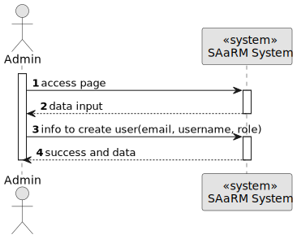
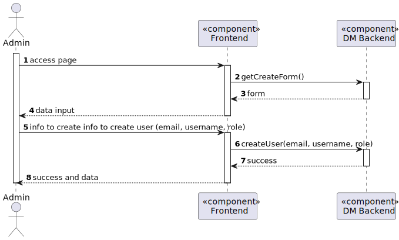
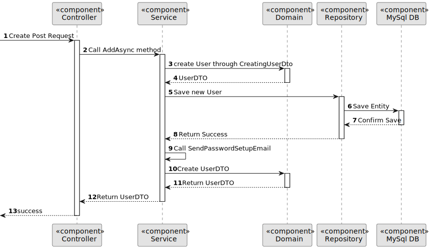

# US 5.1.1


## 1. Context

As part of the development of the software system, it is necessary to implement user management functionalities within the administrative interface. These functionalities are essential to allow administrators to control user access, manage permissions and monitor user activity in the system. This is the first time this task has been assigned for development.
This is the first time this task has been assigned for development.

## 2. Requirements

**US 5.1.1** As an Admin, I want to register new backoffice users (e.g., doctors, nurses,
technicians, admins) via an out-of-band process, so that they can access the
backoffice system with appropriate permissions.


**Acceptance Criteria:** 

- Backoffice users (e.g., doctors, nurses, technicians) are registered by an Admin via an internal
process, not via self-registration.

- Admin assigns roles (e.g., Doctor, Nurse, Technician) during the registration process.

- Registered users receive a one-time setup link via email to set their password and activate their
account.

- The system enforces strong password requirements for security.

- A confirmation email is sent to verify the user’s registration.

- The user’s IAM record is linked to the respective user and staff/patient record
in the backoffice data.

- All users authenticate using the IAM.

- Pawword must have at least 10 characters long, at least a digit, a capital letter and a special character.

- Account locked if log in errror 5 times.


**Customer Specifications and Clarifications:**

> **Question:** Can the user only be a staff member or patient, or can they be something else? 
>
>**Answer:** The users of the system are the administrators, nurses and doctors, as well as the patients (with limited functionality).


> **Question:** Does the user have contact information, email and phone, both are mandatory?
>
>**Answer:** Yes.


>**Question:**  Chapter 3.2 says that "Backoffice users are registered by the admin in the IAM through an out-of-band process.", but US 5.1.1 says that "Backoffice users are registered by an Admin via an internal process, not via self-registration.". Can you please clarify if backoffice users registration uses the IAM system? And if the IAM system is the out-of-band process?
>
>**Answer:** What this means is that backoffice users can not self-register in the system like the patients do. the admin must register the backoffice user. If you are using an external IAM (e.g., Google, Azzure, Linkedin, ...) the backoffice user must first create their account in the IAM provider and then pass the credential info to the admin so that the user account in the system is "linked" wit the external identity provider.


> **Question:** Can you clarify the username and email requirements?
>
>**Answer:**The username is the "official" email address of the user. for backoffice users, this is the mechanographic number of the collaborator, e.g., D240003 or N190345, and the DNS domain of the system. For instance, Doctor Manuela Fernandes has email "D180023@myhospital.com". The system must allow for an easy configuration of the DNS domain (e.g., environment variable).
>For patients, the username is the email address provided in the patient record and used as identity in the external IAM. for instance patient Carlos Silva has provided his email csilva98@gmail.com the first time he entered the hospital. That email address will be his username when he self-registers in the system


>**Question**: What defines session inactivity?
>
> **Answer**: Inactivity is defined as no interaction with the API. After 20 minutes of inactivity, the session should disconnect.

**Dependencies/References:**

* There are no dependencies to other US.

**Input and Output Data**

**Input Data:**

* Typed data:
    * E-mail
    * Username
    * Role


**Output Data:**
* Display the success of the operation and the data of the registered user (Add User)


## 3. Analysis

>**Question**: What happens when a user fails to log in more than five times, and what is the process for unlocking their account?
>
> **Answer**: After five failed login attempts, the system will temporarily lock the account. The process for unlocking the account is typically handled outside the system by an administrator, who would verify that the failed attempts were not made with malicious intent. However, this unlocking process is not part of the current system


[//]: # (### 3.1. Domain Model)

[//]: # (![sub domain model]&#40;us1000-sub-domain-model.svg&#41;)

## 4. Design


**Domain Class/es:** Email, User, UserDto, Role

**Controller:** UserController

**UI:** 

**Repository:**	UserRepository

**Service:** UserService, AuthorizationService


### 4.1. Sequence Diagram

**Register User Level 1**


**Register User Level 2**


**Register User Level 3**



[//]: # (### 4.2. Class Diagram)

[//]: # ()
[//]: # (![a class diagram]&#40;us1000-class-diagram.svg "A Class Diagram"&#41;)

### 4.3. Applied Patterns

### 4.4. Tests

Include here the main tests used to validate the functionality. Focus on how they relate to the acceptance criteria.


**Before Tests** **Setup of Dummy Users**

```
    public static SystemUser dummyUser(final String email, final Role... roles) {
        final SystemUserBuilder userBuilder = new SystemUserBuilder(new NilPasswordPolicy(), new PlainTextEncoder());
        return userBuilder.with(email, "duMMy1", "dummy", "dummy", email).build();
    }

    public static SystemUser crocodileUser(final String email, final Role... roles) {
        final SystemUserBuilder userBuilder = new SystemUserBuilder(new NilPasswordPolicy(), new PlainTextEncoder());
        return userBuilder.with(email, "CroC1_", "Crocodile", "SandTomb", email).withRoles(roles).build();
    }

    private SystemUser getNewUserFirst() {
        return dummyUser("dummy@gmail.com", Roles.ADMIN);
    }

    private SystemUser getNewUserSecond() {
        return crocodileUser("crocodile@gmail.com", Roles.OPERATOR);
    }

```

**Test 1:** *Verifies if Users are equals*


```
@Test
public void verifyIfUsersAreEquals() {
    assertTrue(getNewUserFirst().equals(getNewUserFirst()));
}
````


## 5. Implementation


### Methods in the UsersController
* **public async Task<ActionResult<UserDto>> Create(CreatingUserDto dto)**  this method creates a user


## 6. Integration/Demonstration


[//]: # (## 7. Observations)

[//]: # ()
[//]: # (*This section should be used to include any content that does not fit any of the previous sections.*)

[//]: # ()
[//]: # (*The team should present here, for instance, a critical perspective on the developed work including the analysis of alternative solutions or related works*)

[//]: # ()
[//]: # (*The team should include in this section statements/references regarding third party works that were used in the development this work.*)