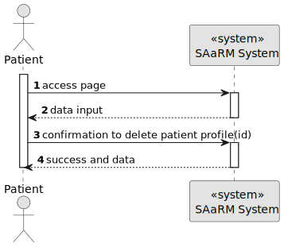
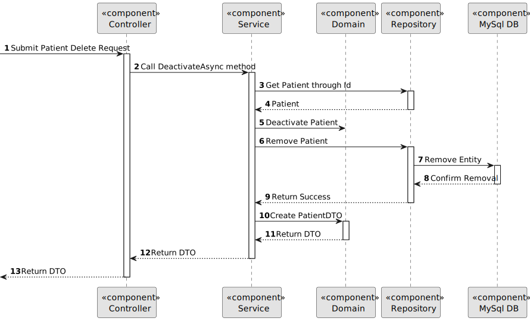

# US 5.1.10


## 1. Context

As an Admin, I want to delete a patient profile, so that I can remove patients who are no longer under care
## 2. Requirements

**US 5.1.10** 

**Acceptance Criteria:** 

- Admins can search for a patient profile and mark it for deletion.
- Before deletion, the system prompts the admin to confirm the action.
- Once deleted, all patient data is permanently removed from the system within a predefined time frame.
- The system logs the deletion for audit and GDPR compliance purposes.

**Customer Specifications and Clarifications:**

[//]: # (TODO: Ir buscar as perguntas)

> **Question 1: When generating the audit record to log the deletion of patient profiles what patient information (if any) are we allowed to keep in the log for identification purposes? If none are the logs then only a record of deletion operations and not actually tied to the deletion of a specific patient?**
>
> **Answer 1: The ERS (health regulator) issued an opinion on the retention of health data in which it established a minimum retention period of 5 years, after which the data can be deleted. You may wish to keep some of the information anonymised for statistical purposes only, limiting yourself to, for example, gender and type of surgery.** 

> **Question 2: Gostávamos de perguntar se na funcionalidade que pretende que envolve remover o perfil de pacientes que já não se encontram a receber ajuda ou tratamento da entidade hospitalar (5.1.10) se quando é mencionado "(...)all patient data is permanently removed from the system within a predefined time frame." se o tempo predefinido é do sistema em si ou se é definido pelo admin que apaga os dados.**
>
> **Answer 2: Faz parte das vossas responsabilidades no âmbito do módulo de proteçãod e dados e de acordo com a politica que venham a definir**

> **Question 3:**
>
> **Answer 3:**

**Dependencies/References:**

* There is a dependency to "US 5.1.1 - As an Admin, I want to register new backoffice users (e.g., doctors, nurses, technicians, admins) via an out-of-band process, so that they can access the backoffice system with appropriate permissions."

* There is a dependency to "US 5.1.6 - As a (non-authenticated) Backoffice User, I want to log in to the system using my credentials, so that I can access the backoffice features according to my assigned role."

* There is a dependency to "US 5.1.8 - As an Admin, I want to create a new patient profile, so that I can register their personal details and medical history."

**Input and Output Data**

**Input Data:**

* Typed data:
    * Id


**Output Data:**
* Display the success of the operation and the data of the deleted patient (Delete Patient)

## 3. Analysis

> **Question 1:**
>
> **Answer 1:** 

[//]: # (### 3.1. Domain Model)

[//]: # (![sub domain model]&#40;us1000-sub-domain-model.svg&#41;)

## 4. Design


**Domain Class/es:** Email, Patient, MedicalRecordNumber, PhoneNumber

**Controller:** PatientController

**UI:**

**Repository:**	PatientRepository, LogsRepository

**Service:** PatientService, AuthorizationService, LogsService, GmailService


### 4.1. Sequence Diagram

#### Delete Patient Profile

**Sequence Diagram Level 1**



**Sequence Diagram Level 2**


**Sequence Diagram Level 3**




[//]: # (TODO: Necessario fazer algo ?)

### 4.2. Applied Patterns

### 4.3. Tests

Include here the main tests used to validate the functionality. Focus on how they relate to the acceptance criteria.


**Before Tests** **Setup of Dummy Users**

```
    public static SystemUser dummyUser(final String email, final Role... roles) {
        final SystemUserBuilder userBuilder = new SystemUserBuilder(new NilPasswordPolicy(), new PlainTextEncoder());
        return userBuilder.with(email, "duMMy1", "dummy", "dummy", email).build();
    }

    public static SystemUser crocodileUser(final String email, final Role... roles) {
        final SystemUserBuilder userBuilder = new SystemUserBuilder(new NilPasswordPolicy(), new PlainTextEncoder());
        return userBuilder.with(email, "CroC1_", "Crocodile", "SandTomb", email).withRoles(roles).build();
    }

    private SystemUser getNewUserFirst() {
        return dummyUser("dummy@gmail.com", Roles.ADMIN);
    }

    private SystemUser getNewUserSecond() {
        return crocodileUser("crocodile@gmail.com", Roles.OPERATOR);
    }

```

**Test 1:** *Verifies if Users are equals*


```
@Test
public void verifyIfUsersAreEquals() {
    assertTrue(getNewUserFirst().equals(getNewUserFirst()));
}
````


[//]: # (## 5. Implementation)

[//]: # ()
[//]: # ()
[//]: # (### Methods in the ListUsersController)

[//]: # (* **Iterable<SystemUser> filteredUsersOfBackOffice&#40;&#41;**  this method filters to list all backoffice users)

[//]: # ()
[//]: # ()
[//]: # ()
[//]: # (### Methods in the AddUsersController)

[//]: # ()
[//]: # (* **Role[] getRoleTypes&#40;&#41;** this method list the roles to choose for the User)

[//]: # ()
[//]: # (* **SystemUser addUser&#40;final String email, final String password, final String firstName,)

[//]: # (  final String lastName, final Set<Role> roles, final Calendar createdOn&#41;**  this method send the information to create the User.)

[//]: # ()
[//]: # (* **String generatePassword&#40;&#41;** this method automatically generate a password for the User. )

[//]: # ()
[//]: # ()
[//]: # ()
[//]: # (### Methods in the DeactivateUsersController)

[//]: # ()
[//]: # (* **Iterable<SystemUser> activeUsers&#40;&#41;** this method list all the activated Users. )

[//]: # ()
[//]: # (* **Iterable<SystemUser> deactiveUsers&#40;&#41;** this method list all the deactivated Users.)

[//]: # ()
[//]: # (* **SystemUser activateUser&#40;final SystemUser user&#41;** this method activate the chosen User.)

[//]: # ()
[//]: # (* **SystemUser deactivateUser&#40;final SystemUser user&#41;** this method deactivate the chosen User. )

[//]: # ()
[//]: # ()
[//]: # (## 6. Integration/Demonstration)


[//]: # (## 7. Observations)

[//]: # ()
[//]: # (*This section should be used to include any content that does not fit any of the previous sections.*)

[//]: # ()
[//]: # (*The team should present here, for instance, a critical perspective on the developed work including the analysis of alternative solutions or related works*)

[//]: # ()
[//]: # (*The team should include in this section statements/references regarding third party works that were used in the development this work.*)