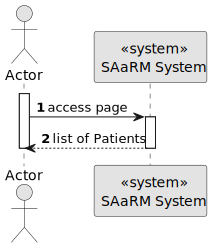
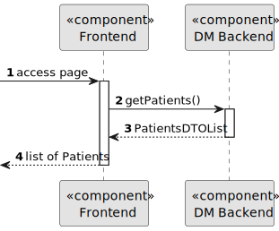
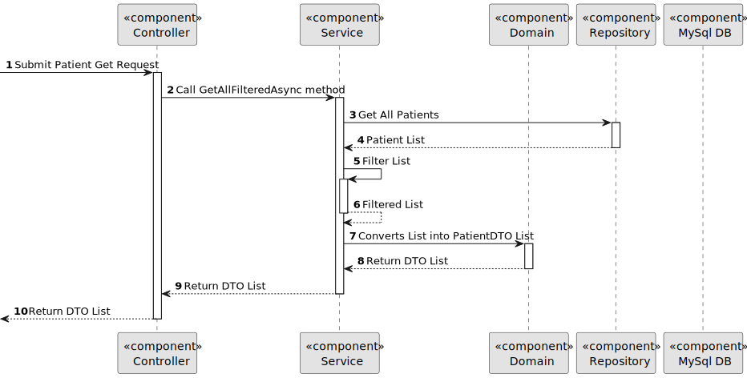

# US 5.1.11


## 1. Context

As an Admin, I want to list/search patient profiles by different attributes, so that I can view the details, edit, and remove patient profiles.

## 2. Requirements

**US 5.1.11** 

**Acceptance Criteria:** 

- Admins can search patient profiles by various attributes, including name, email, date of birth, or medical record number.
- The system displays search results in a list view with key patient information (name, email, date of birth).
- Admins can select a profile from the list to view, edit, or delete the patient record. 
- The search results are paginated, and filters are available to refine the search results.

**Customer Specifications and Clarifications:**


> **Question 1:**
>
> **Answer 1:** 


**Dependencies/References:**

* There is a dependency to "US 5.1.1 - As an Admin, I want to register new backoffice users (e.g., doctors, nurses, technicians, admins) via an out-of-band process, so that they can access the backoffice system with appropriate permissions."

* There is a dependency to "US 5.1.6 - As a (non-authenticated) Backoffice User, I want to log in to the system using my credentials, so that I can access the backoffice features according to my assigned role."

* There is a dependency to "US 5.1.8 - As an Admin, I want to create a new patient profile, so that I can register their personal details and medical history."

**Input and Output Data**

**Input Data:**

* Typed data:
    * Id (Optional)
    * Medical Record Number (Optional)
    * Email (Optional)
    * Name (Optional)
    * Date of Birth (Optional)


* Selected data:
    * None


**Output Data:**
* Display the success of the operation and the data of the listed patients (List Patient)


## 3. Analysis

> **Question 1:** 
>
> **Answer 1:** 

[//]: # (### 3.1. Domain Model)

[//]: # (![sub domain model]&#40;us1000-sub-domain-model.svg&#41;)

## 4. Design


**Domain Class/es:** Email, Patient, PatientDto

**Controller:** PatientController

**UI:**

**Repository:**	PatientRepository

**Service:** PatientService, AuthorizationService


### 4.1. Sequence Diagram

#### List Patient Profile

**Sequence Diagram Level 1**



**Sequence Diagram Level 2**



**Sequence Diagram Level 3**




### 4.2. Applied Patterns

### 4.3. Tests

Include here the main tests used to validate the functionality. Focus on how they relate to the acceptance criteria.


**Before Tests** **Setup of Dummy Users**

```
    public static SystemUser dummyUser(final String email, final Role... roles) {
        final SystemUserBuilder userBuilder = new SystemUserBuilder(new NilPasswordPolicy(), new PlainTextEncoder());
        return userBuilder.with(email, "duMMy1", "dummy", "dummy", email).build();
    }

    public static SystemUser crocodileUser(final String email, final Role... roles) {
        final SystemUserBuilder userBuilder = new SystemUserBuilder(new NilPasswordPolicy(), new PlainTextEncoder());
        return userBuilder.with(email, "CroC1_", "Crocodile", "SandTomb", email).withRoles(roles).build();
    }

    private SystemUser getNewUserFirst() {
        return dummyUser("dummy@gmail.com", Roles.ADMIN);
    }

    private SystemUser getNewUserSecond() {
        return crocodileUser("crocodile@gmail.com", Roles.OPERATOR);
    }

```

**Test 1:** *Verifies if Users are equals*


```
@Test
public void verifyIfUsersAreEquals() {
    assertTrue(getNewUserFirst().equals(getNewUserFirst()));
}
````


[//]: # (## 5. Implementation)

[//]: # ()
[//]: # ()
[//]: # (### Methods in the ListUsersController)

[//]: # (* **Iterable<SystemUser> filteredUsersOfBackOffice&#40;&#41;**  this method filters to list all backoffice users)

[//]: # ()
[//]: # ()
[//]: # ()
[//]: # (### Methods in the AddUsersController)

[//]: # ()
[//]: # (* **Role[] getRoleTypes&#40;&#41;** this method list the roles to choose for the User)

[//]: # ()
[//]: # (* **SystemUser addUser&#40;final String email, final String password, final String firstName,)

[//]: # (  final String lastName, final Set<Role> roles, final Calendar createdOn&#41;**  this method send the information to create the User.)

[//]: # ()
[//]: # (* **String generatePassword&#40;&#41;** this method automatically generate a password for the User. )

[//]: # ()
[//]: # ()
[//]: # ()
[//]: # (### Methods in the DeactivateUsersController)

[//]: # ()
[//]: # (* **Iterable<SystemUser> activeUsers&#40;&#41;** this method list all the activated Users. )

[//]: # ()
[//]: # (* **Iterable<SystemUser> deactiveUsers&#40;&#41;** this method list all the deactivated Users.)

[//]: # ()
[//]: # (* **SystemUser activateUser&#40;final SystemUser user&#41;** this method activate the chosen User.)

[//]: # ()
[//]: # (* **SystemUser deactivateUser&#40;final SystemUser user&#41;** this method deactivate the chosen User. )

[//]: # ()
[//]: # ()
[//]: # (## 6. Integration/Demonstration)


[//]: # (## 7. Observations)

[//]: # ()
[//]: # (*This section should be used to include any content that does not fit any of the previous sections.*)

[//]: # ()
[//]: # (*The team should present here, for instance, a critical perspective on the developed work including the analysis of alternative solutions or related works*)

[//]: # ()
[//]: # (*The team should include in this section statements/references regarding third party works that were used in the development this work.*)