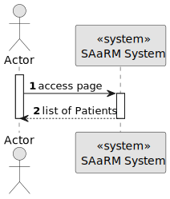

# US 5.1.11


## 1. Context

As an Admin, I want to list/search patient profiles by different attributes, so that I can view the details, edit, and remove patient profiles.

## 2. Requirements

**US 5.1.11** 

**Acceptance Criteria:** 

- Admins can search patient profiles by various attributes, including name, email, date of birth, or medical record number.
- The system displays search results in a list view with key patient information (name, email, date of birth).
- Admins can select a profile from the list to view, edit, or delete the patient record. 
- The search results are paginated, and filters are available to refine the search results.

**Customer Specifications and Clarifications:**

[//]: # (TODO: Verificar as perguntas melhor para este)

> **Question 1:**
>
> **Answer 1:** 


**Dependencies/References:**

[//]: # (* There is a dependency to "USG007:  "As a Project Manager, I want the system to support and apply authentication and authorization for all its users and functionalities.", since is necessary to be able to Sign Up as admin to create others Users.)

**Input and Output Data**

**Input Data:**

* Typed data:
    * None


* Selected data:
    * None


**Output Data:**e 
* Display the success of the operation and the data of the listed patients (List Patient)


## 3. Analysis

> **Question 97:** US1000 – Regarding user registration, should these all be considered "enable" by default or should there be an option to "enable/disable" users during the registration process?
>
> **Answer:** In the context of the US1000 it should be possible to activate and deactivate users. I suppose they should be active by default.

### 3.1. Domain Model


## 4. Design


**Domain Class/es:** E-mail, SystemUser

**Controller:** DeactivateUserController, AddUserController, ListUserController

**UI:** DeactivateUserUI, AddUserUI, ListUserUI

**Repository:**	UserRepository

**Service:** UserManagementService, AuthorizationService


### 4.1. Sequence Diagram

#### List Patient Profile

**Sequence Diagram Level 1**



**Sequence Diagram Level 2**


**Sequence Diagram Level 3**


### 4.2. Applied Patterns

### 4.3. Tests

Include here the main tests used to validate the functionality. Focus on how they relate to the acceptance criteria.


**Before Tests** **Setup of Dummy Users**

```
    public static SystemUser dummyUser(final String email, final Role... roles) {
        final SystemUserBuilder userBuilder = new SystemUserBuilder(new NilPasswordPolicy(), new PlainTextEncoder());
        return userBuilder.with(email, "duMMy1", "dummy", "dummy", email).build();
    }

    public static SystemUser crocodileUser(final String email, final Role... roles) {
        final SystemUserBuilder userBuilder = new SystemUserBuilder(new NilPasswordPolicy(), new PlainTextEncoder());
        return userBuilder.with(email, "CroC1_", "Crocodile", "SandTomb", email).withRoles(roles).build();
    }

    private SystemUser getNewUserFirst() {
        return dummyUser("dummy@gmail.com", Roles.ADMIN);
    }

    private SystemUser getNewUserSecond() {
        return crocodileUser("crocodile@gmail.com", Roles.OPERATOR);
    }

```

**Test 1:** *Verifies if Users are equals*


```
@Test
public void verifyIfUsersAreEquals() {
    assertTrue(getNewUserFirst().equals(getNewUserFirst()));
}
````


## 5. Implementation


### Methods in the ListUsersController
* **Iterable<SystemUser> filteredUsersOfBackOffice()**  this method filters to list all backoffice users


### Methods in the AddUsersController

* **Role[] getRoleTypes()** this method list the roles to choose for the User

* **SystemUser addUser(final String email, final String password, final String firstName,
  final String lastName, final Set<Role> roles, final Calendar createdOn)**  this method send the information to create the User.

* **String generatePassword()** this method automatically generate a password for the User. 


### Methods in the DeactivateUsersController

* **Iterable<SystemUser> activeUsers()** this method list all the activated Users. 

* **Iterable<SystemUser> deactiveUsers()** this method list all the deactivated Users.

* **SystemUser activateUser(final SystemUser user)** this method activate the chosen User.

* **SystemUser deactivateUser(final SystemUser user)** this method deactivate the chosen User. 


## 6. Integration/Demonstration


[//]: # (## 7. Observations)

[//]: # ()
[//]: # (*This section should be used to include any content that does not fit any of the previous sections.*)

[//]: # ()
[//]: # (*The team should present here, for instance, a critical perspective on the developed work including the analysis of alternative solutions or related works*)

[//]: # ()
[//]: # (*The team should include in this section statements/references regarding third party works that were used in the development this work.*)