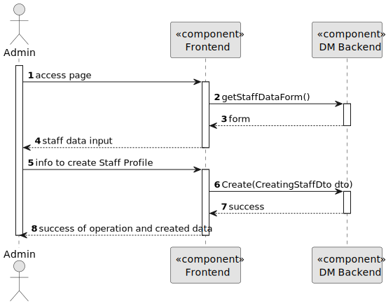
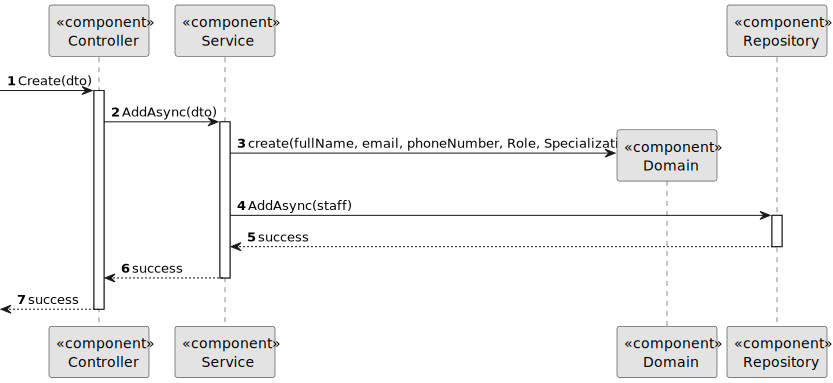

# US 5.1.12


## 1. Context

As part of the development of the software system, it is necessary to implement functionality that allows administrators to create new Staff Profiles. This is the first time this task has been assigned for development.

## 2. Requirements

**US 5.1.12** 

**Acceptance Criteria:** 

- Admins can input staff details such as first name, last name, contact information, and specialization.
- A unique staff ID (License Number) is generated upon profile creation.
- The system ensures that the staff's email and phone number are unique.
- The profile is stored securely, and access is based on role-based permissions.

**Customer Specifications and Clarifications:**

> **Question:** How should the specialization be assigned to a staff? Should the admin write it like a first name? Or should the admin select the specialization?
>
> **Answer:** The system has a list of specializations. staff is assigned a specialization from that list

> **Question:** Can a doctor have more than one Expertise?
>
> **Answer:** No. consider only one specialization per doctor

> **Question:** Are healthcare staff IDs unique across roles? 
>
> **Answer:** Yes, staff IDs are unique and not role-specific (e.g., a doctor and nurse can share the same ID format).

> **Question:** Will the staff availability slots have a "time gap" of hour to hour, customizable or another time? [Translated]
> 
> **Answer:** Staff availability is typically in 15 minute blocks [Translated]

> **Question:** Can doctors and nurses have just one specialty or can they be specialists in several? [Translated]
>
> **Answer:** A doctor or nurse has only one specialization [Translated]

> **Question:** Who is part of the staff? Everyone in the operating room? If so, do they all have their respective specialties, including technicians? [Translated]
>
> **Answer:** In the staff we only consider doctors and nurses. [Translated]

> **Question:** I would like to know if the system aims to differentiate specializations for each type of staff. In other words, if we have to validate that specialization Valid specializations according to the staff role. [Translated]
>
> **Answer:** Specializations do not depend on whether the professional is a doctor or nurse. [Translated]

> **Question:** Will there be a list of specializations in the system? 
>
> **Answer:** Yes, a predefined list of specializations will be provided, but the system should allow for future additions.

> **Question:** Are roles like "instrumenting" or "circulating" specializations? 
>
> **Answer:** Yes, these represent specializations, but the system focuses more on general specializations (e.g., orthopedic, pulmonologist).

> **Question:** I have one question related to the staff license number. Since it will be generated, would you like it to be generated in any particular format or algorithm of your choice?
>
> **Answer:** There is a misinformation in the RFP. staff id are unique and generated by the system. License numbers are unique but are not generated by the system.
> Staff id follow the format "(N | D | O)yyyynnnnn", for instance, N202401234
> N is for nurse, D is for doctor, O is for other.
> yyyy is the year of recruitment
> nnnnn is a sequential number
> License numbers are assigned by the professional guild. the admin will enter the license number and the system records it

> **Question:** Can you clarify the difference between mechanographic number, staff id and license number?
>
> **Answer:** The staff id and mechanographic number is the same concept. The license number is the number assigned by the professional guild (ex., "ordem dos enfermeiros", "ordem dos médicos") to the doctor or nurse attesting they legally can perform the medical acts of their profession

> **Question:** How are we supposed to generate an ID that needs the role to be correctly generated upon profile creation if there is no information about the role of the staff upon profile creation and firstly the profile is created and only then can be linked to an account which actually contains information about the role.
>
> **Answer:** When the admin creates an account they assign it a role for role-based permissions, e.g., someone with role A can access function F1 but not F2. When the admin creates a staff profile they assign it a role/category to describe the capabilities and responsibilities of that person within the system, e.g., someone with role/category "Doctor" has a specialization "X" and requests an operation of type "O" for a patient "P"


**Dependencies/References:**

**Input and Output Data**

**Input Data:**

* Typed data:
    * First Name
    * Last Name
    * License Number
    * Contact Information
        * E-mail
        * Phone number

* Selected data:
    * Role
    * Specialization

* Generated data:
    * Staff Id


**Output Data:**
* Display the success of the operation and the data of the registered Staff Profile

## 3. Analysis


### 3.1. Domain Model


## 4. Design


**Domain Class/es:** Staff, Name, Email, Role, Specialization

**Controller:** StaffController

**UI:** None

**Repository:**	StaffRepository

**Service:** StaffService


### 4.1. Sequence Diagram

**Level One**


**Level Two**



**Level Three**




[//]: # (### 4.2. Class Diagram)

[//]: # (![a class diagram](us1000-class-diagram.svg "A Class Diagram"))

[//]: # (### 4.3. Applied Patterns)

### 4.2. Tests

Include here the main tests used to validate the functionality. Focus on how they relate to the acceptance criteria.


**Before Tests** **Setup of Dummy Users**

```

```

**Test 1:** *Verifies if Users are equals*


```

```


## 5. Implementation


### Methods in StaffController
* **Task<ActionResult<StaffDto>> Create(CreatingStaffDto dto)**  this method receives the info from the API and redirects it to the Service

### Methods in the StaffService
* **Task<StaffDto> AddAsync(CreatingStaffDto dto)** this method creates a new Staff Profile and sends it to the repository to be saved

### Methods in the StaffRepository
* **Task<StaffProfile> AddAsync(StaffProfile staff)** this method saves the new Staff Profile in the database

## 6. Integration/Demonstration


[//]: # (## 7. Observations)

[//]: # ()
[//]: # (*This section should be used to include any content that does not fit any of the previous sections.*)

[//]: # ()
[//]: # (*The team should present here, for instance, a critical perspective on the developed work including the analysis of alternative solutions or related works*)

[//]: # ()
[//]: # (*The team should include in this section statements/references regarding third party works that were used in the development this work.*)