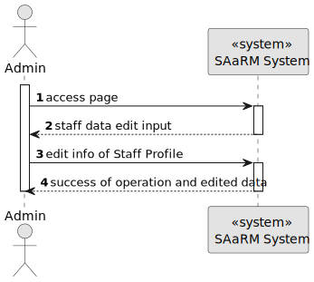
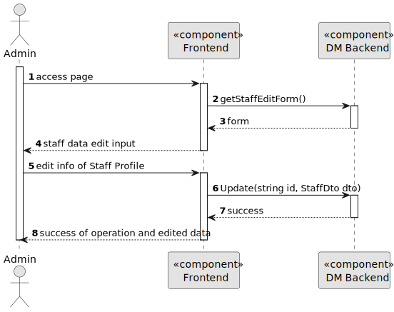
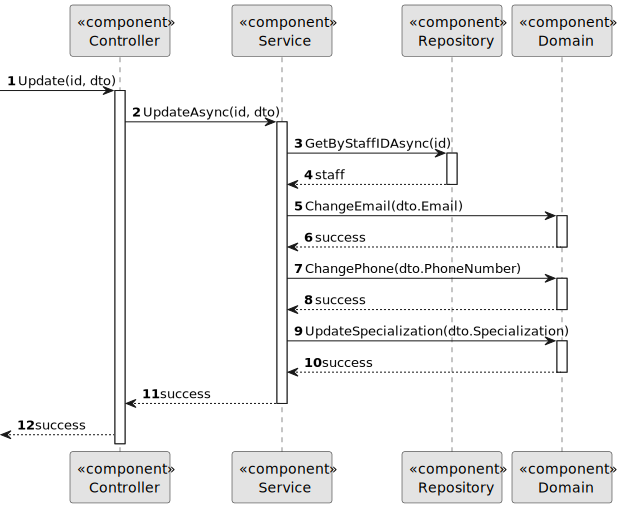

# US 5.1.13


## 1. Context

As part of the development of the software system, it is necessary to implement functionality that allows administrators to edit existing Staff Profiles. This is the first time this task has been assigned for development.

## 2. Requirements

**US 5.1.13** 

**Acceptance Criteria:** 

- Admins can search for and select a staff profile to edit.
- Editable fields include contact information, availability slots, and specialization.
- The system logs all profile changes, and any changes to contact information trigger a confirmation email to the staff member.
- The edited data is updated in real-time across the system.

**Customer Specifications and Clarifications:**

> **Question:** In us 5.1.12, it is mentioned that the admin can only enter the first name, last name, contact information and specialization. However, in us 5.1.13, it is mentioned that the admin can edit the contact information, availability slots and specialization. Should the admin only be able to edit the parameters he entered or does it make sense to be able to edit the availability slots? [Translated]
>
> **Answer:** Consider editing availability slots as a separate operation and outside the scope of this requirement [Translated]


**Dependencies/References:**

* There is a dependency to "5.1.12", since it is necessary to have a a Staff Profile in order to edit it.

**Input and Output Data**

**Input Data:**

* Typed data:
    * Contact Information
        * E-mail
        * Phone number


* Selected data:
    * Staff Profile
    * Specialization


**Output Data:**
* Display the success of the operation and the data of the updated Staff Profile

## 3. Analysis

### 3.1. Domain Model


## 4. Design


**Domain Class/es:** Staff, Role, Specialization

**Controller:** StaffController

**UI:** None

**Repository:**	StaffRepository

**Service:** StaffService, AuthorizationService


### 4.1. Sequence Diagram

**Level One**



**Level Two**



**Level Three**




[//]: # (### 4.2. Class Diagram)

[//]: # (![a class diagram]&#40;us1000-class-diagram.svg "A Class Diagram"&#41;)

[//]: # (### 4.3. Applied Patterns)

### 4.2. Tests

Include here the main tests used to validate the functionality. Focus on how they relate to the acceptance criteria.


**Before Tests** **Setup of Dummy Users**

```

```

**Test 1:** *Verifies if Users are equals*

```

````


## 5. Implementation

### Methods in StaffController
* **Task<ActionResult<StaffDto>> Update(string id, StaffDto dto)**  this method receives the info from the API and redirects it to the Service

### Methods in the StaffService
* **Task<StaffDto> UpdateAsync(StaffDto dto)** this method updates a Staff Profile's information

### Methods in the StaffRepository
* **Task<StaffProfile> GetByStaffIDAsync(id)** this method retrieves a Staff Profile from the database by its ID

### Methods in the StaffProfile

[//]: # (* **void ChangeLicenseNumber&#40;string licenseNumber&#41;&#41;** this method updates the StaffProfile's License Number attribute)
* **void ChangePhone(PhoneNumber phone)** this method updates the StaffProfile's Phone Number attribute
* **void ChangeEmail(Email email)** this method updates the StaffProfile's Email attribute
* **void UpdateSpecialization(string specialization)** this method updates the StaffProfile's Specialization attribute

[//]: # (* **void UpdateSlots&#40;List<Slot> slots&#41;** this method updates the StaffProfile's active attribute)

## 6. Integration/Demonstration


[//]: # (## 7. Observations)

[//]: # ()
[//]: # (*This section should be used to include any content that does not fit any of the previous sections.*)

[//]: # ()
[//]: # (*The team should present here, for instance, a critical perspective on the developed work including the analysis of alternative solutions or related works*)

[//]: # ()
[//]: # (*The team should include in this section statements/references regarding third party works that were used in the development this work.*)