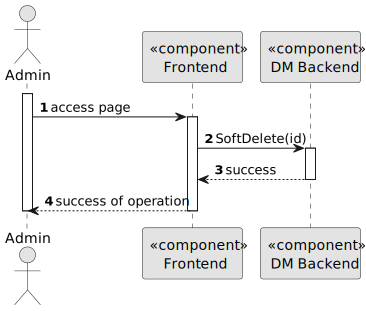

# US 5.1.14


## 1. Context

As part of the development of the software system, it is necessary to implement functionality that allows administrators to deactivate a Staff Profile. This is the first time this task has been assigned for development.

## 2. Requirements

**US 5.1.14** 

**Acceptance Criteria:** 

- Admins can search for and select a staff profile to deactivate.
- Deactivating a staff profile removes them from the active roster, but their historical data (e.g., appointments) remains accessible.
- The system confirms deactivation and records the action for audit purposes.

[//]: # (**Customer Specifications and Clarifications:**)

[//]: # ()
[//]: # (> **Question:** )

[//]: # (>)

[//]: # (> **Answer:** )


**Dependencies/References:**

* There is a dependency to "5.1.12", since it is necessary to have a Staff Profile in order to deactivate it.

**Input and Output Data**

**Input Data:**

* Selected data:
    * Staff Profile 


**Output Data:**
* Display the success of the operation.

## 3. Analysis

### 3.1. Domain Model


## 4. Design


**Domain Class/es:** Staff

**Controller:** StaffController

**UI:** None

**Repository:**	StaffRepository

**Service:** StaffService


### 4.1. Sequence Diagram

**Level One**


**Level Two**



**Level Three**


[//]: # (### 4.2. Class Diagram)

[//]: # (![a class diagram]&#40;us1000-class-diagram.svg "A Class Diagram"&#41;)

[//]: # (### 4.3. Applied Patterns)

### 4.2. Tests

Include here the main tests used to validate the functionality. Focus on how they relate to the acceptance criteria.


**Before Tests** **Setup of Dummy Users**

```

```

**Test 1:** *Verifies if Users are equals*

```

````


## 5. Implementation


### Methods in StaffController
* **Task<ActionResult<StaffDto>> SoftDelete(string id)**  this method receives the info from the API and redirects it to the Service

### Methods in the StaffService
* **Task<StaffDto> InactivateAsync(string id)** this method deactivates a Staff Profile

### Methods in the StaffRepository
* **Task<StaffProfile> GetByStaffIDAsync(id)** this method retrieves a Staff Profile from the database by its ID

### Methods in the StaffProfile
* **void MarkAsInative()** this method updates the StaffProfile's active attribute


## 6. Integration/Demonstration


[//]: # (## 7. Observations)

[//]: # ()
[//]: # (*This section should be used to include any content that does not fit any of the previous sections.*)

[//]: # ()
[//]: # (*The team should present here, for instance, a critical perspective on the developed work including the analysis of alternative solutions or related works*)

[//]: # ()
[//]: # (*The team should include in this section statements/references regarding third party works that were used in the development this work.*)