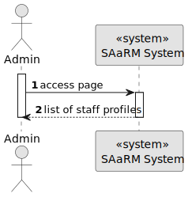
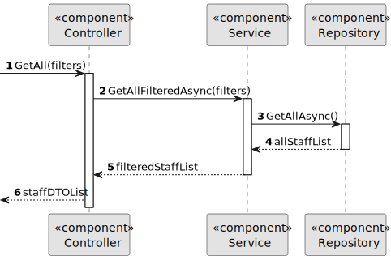

# US 5.1.15


## 1. Context

As part of the development of the software system, it is necessary to implement functionalities that let an Admin list all Staff Profiles. This is the first time this task has been assigned for development.

## 2. Requirements

**US 5.1.15** 

**Acceptance Criteria:** 

- Admins can search staff profiles by attributes such as name, email, or specialization.
- The system displays search results in a list view with key staff information (name, email, specialization).
- Admins can select a profile from the list to view, edit, or deactivate.
- The search results are paginated, and filters are available for refining the search results.


**Customer Specifications and Clarifications:**

> **Question:** What types of filters can be applied when searching for profiles?
>
> **Answer:** Filters can include doctor specialization, name, or email to refine search results.

> **Question:** The filters are And or OR. For example, if I filter for a Patient named John and Age 24, do you want every John who is 24 years old or every Patient who is called John or is 24 years old
>
> **Answer:** If more than one search/filter parameter is used, the combination of filters should be considered as AND

**Dependencies/References:**

* There is a dependency to "5.1.12", since is necessary to have a Staff Profile in order to list it.

**Input and Output Data**

**Input Data:**

* Typed data:
    * Filters:
      * Name
      * Email


* Selected data:
    * Filters:
      * Specialization


**Output Data:**
* Display the success of the operation and the list of Staff Profiles.

## 3. Analysis

## 4. Design

**Domain Class/es:** Staff

**Controller:** StaffController

**UI:** None

**Repository:**	StaffRepository

**Service:** StaffService, AuthorizationService


### 4.1. Sequence Diagram

**Level One**



**Level Two**


**Level Three**




### 4.2. Tests

Include here the main tests used to validate the functionality. Focus on how they relate to the acceptance criteria.


**Before Tests** **Setup of Dummy Users**

```

```

**Test 1:** *Verifies if Users are equals*

```

````


## 5. Implementation


### Methods in StaffController
* **Task<ActionResult<IEnumerable<StaffDto>>> GetAll([FromQuery] GetStaffQueryObject request)**  this method receives the info from the API and redirects it to the Service

### Methods in the StaffService
* **Task<List<StaffDto>> GetAllFilteredAsync(string? id, string? name, string? license, string? phone, string? specialization, string? role)** this method retrieves the list of Staff Profiles and then filters it.

### Methods in the StaffRepository
* **Task<List<StaffDto>> GetAllAsync()** this method retrieves from the database the list of all Staff Profiles


## 6. Integration/Demonstration


[//]: # (## 7. Observations)

[//]: # ()
[//]: # (*This section should be used to include any content that does not fit any of the previous sections.*)

[//]: # ()
[//]: # (*The team should present here, for instance, a critical perspective on the developed work including the analysis of alternative solutions or related works*)

[//]: # ()
[//]: # (*The team should include in this section statements/references regarding third party works that were used in the development this work.*)