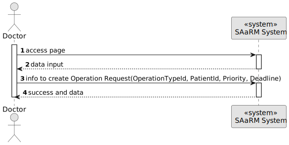

# US 5.1.16

## 1. Context

As a Doctor, I want to request an operation, so that the Patient has access to the necessary healthcare.

## 2. Requirements

**US 5.1.16**

**Acceptance Criteria:**

- Doctors can create an operation request by selecting the patient, operation type, priority, and suggested deadline.
- The system validates that the operation type matches the doctor’s specialization.
- The operation request includes:
- Patient ID
- Doctor ID
- Operation Type
- Deadline
- Priority
- The system confirms successful submission of the operation request and logs the request in
  the patient’s medical history

**Customer Specifications and Clarifications:**

> **Question: In the project document it mentions that each operation has a priority. How is a operation's priority
defined? Do they have priority levels defined? Is it a scale? Or any other system?**
>
> **Answer: Elective Surgery: A planned procedure that is not life-threatening and can be scheduled at a convenient
time (e.g., joint replacement, cataract surgery).
Urgent Surgery: Needs to be done sooner but is not an immediate emergency. Typically within days (e.g., certain types of
cancer surgeries).
Emergency Surgery: Needs immediate intervention to save life, limb, or function. Typically performed within hours (e.g.,
ruptured aneurysm, trauma).**

**Dependencies/References:**

**There are dependencies to USs 5.1.20, 5.1.12, 5.1.8 and 5.1.1.**

* US 5.1.1 - There is the need to be logged and authenticated in the system in order to know the Doctor who created the
  Operation Request.
* US 5.1.8 - There is the need for the existence of patients profiles in the system so I can get one to get the Id for
  the Operation Request.
* US 5.1.12 - There is the need for the existence of staff profiles in the system so I can get the Id of the
  authenticated Doctor for
  the Operation Request.
* US 5.1.20 - There is the need for the existence of operations types in the system so I can get the Id of one for the
  Operation Request.

**Input and Output Data**

**Input Data:**

* Typed data:
    * Id of the Operation Type
    * Id of the Patient
    * Deadline
    * Priority

* Selected data:
    * none

* Gotten from the system
    * Id of the Doctor (from the logged doctor)

* Generated data:
    * Operation Request Id

**Output Data:**

* Display the success of the operation and the data of the created operation request

## 3. Design

**Domain Class/es:** Priority, OperationRequest, CreatingOperationRequestDto, OperationRequestDto, OperationRequestId,
IOperationRequestRepository, ILogRepository, IStaffRepository, IPatientRepository, IOperationTypeRepository

**Controller:** OperationRequestController

**UI:**

**Repository:**    OperationRequestRepository, LogRepository, StaffRepository, PatientRepository,
OperationTypeRepository

**Service:** OperationRequestService, AuthorizationService, LogService

### 3.1. Sequence Diagram

**Register Patient Level 1**

**Register Patient Level 2**

**Register Patient Level 3**

