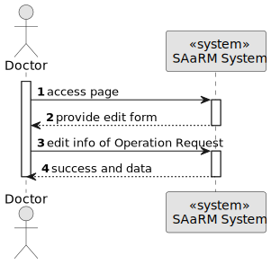
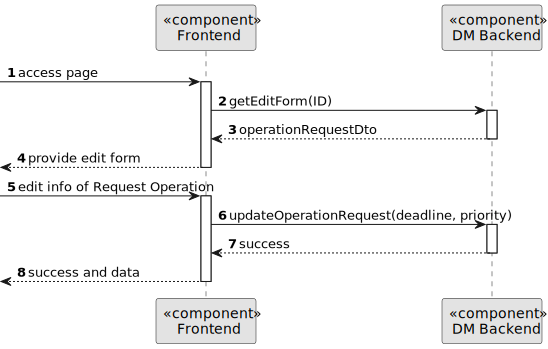
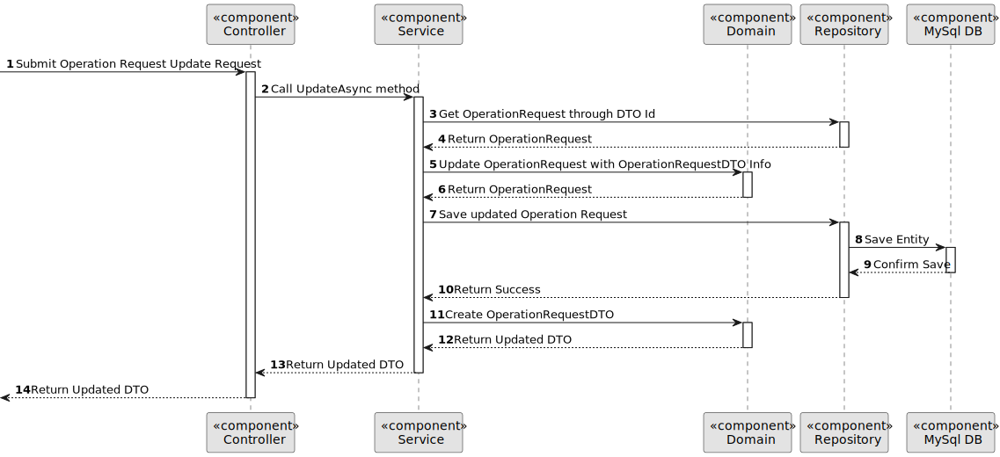

# US 5.1.17

## 1. Context

As a Doctor, I want to update an operation requisition, so that the Patient has access to the necessary healthcare.

## 2. Requirements

**US 5.1.17**

**Acceptance Criteria:**

- Doctors can update operation requests they created (e.g., change the deadline or priority).
- The system checks that only the requesting doctor can update the operation request.
- The system logs all updates to the operation request (e.g., changes to priority or deadline).
- Updated requests are reflected immediately in the system and notify the Planning Module of
  any changes.

**Customer Specifications and Clarifications:**

> **Question: None**

**Dependencies/References:**

**There are dependencies to USs 5.1.1.**

* US 5.1.1 - There is the need to be logged and authenticated in the system in order to know the user executing this
  functionality is a Doctor.

**Input and Output Data**

**Input Data:**

* Typed data:
    * Id of the Operation Request
    * Id of the Doctor
    * Id of the Operation Type
    * Id of the Patient
    * Deadline
    * Priority

* Selected data:
    * none

* Gotten from the system
    * Id of the Doctor (from the logged doctor)

* Generated data:
    * New Operation Request with updated values

**Output Data:**

* Display the success of the operation and the data of the updated operation request

## 3. Design

**Domain Class/es:** Priority, OperationRequest, OperationRequestDto, OperationRequestId,
IOperationRequestRepository, ILogRepository, IStaffRepository

**Controller:** OperationRequestController

**UI:**

**Repository:**    OperationRequestRepository, LogRepository, StaffRepository

**Service:** OperationRequestService, AuthorizationService, LogService

### 3.1. Sequence Diagram

**Register Patient Level 1**

**Register Patient Level 2**

**Register Patient Level 3**

