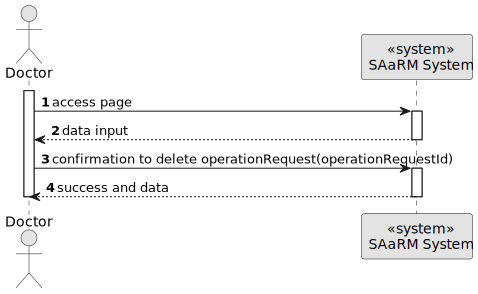
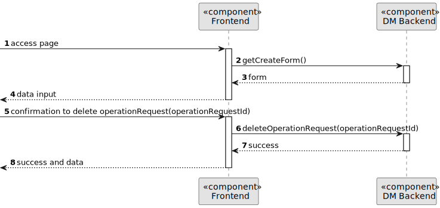
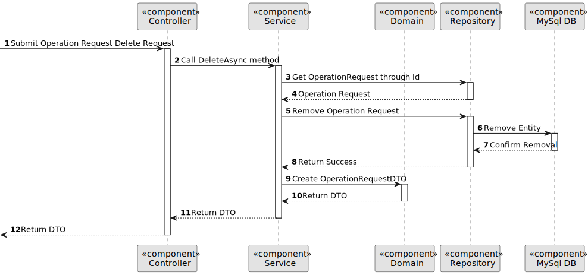

# US 5.1.18

## 1. Context

As a Doctor, I want to remove an operation requisition, so that the healthcare activities are provided as necessary.

## 2. Requirements

**US 5.1.19**

**Acceptance Criteria:**

- Doctors can delete operation requests they created if the operation has not yet been scheduled.
- A confirmation prompt is displayed before deletion.
- Once deleted, the operation request is removed from the patient’s medical record and cannot be recovered.
- The system notifies the Planning Module and updates any schedules that were relying on this request.

**Customer Specifications and Clarifications:**

> **Question: None**

**Dependencies/References:**

**There are dependencies to USs 5.1.1.**

* US 5.1.1 - There is the need to be logged and authenticated in the system in order to know the user executing this
  functionality is a Doctor.

**Input and Output Data**

**Input Data:**

* Typed data:
    * Id of the Operation Request

* Selected data:
    * None

* Gotten from the system
    * Id of the Doctor (from the logged doctor)

* Generated data:
    * None

**Output Data:**

* Display the success of the operation and the data of the deleted operation request

## 3. Analysis

*?????*

## 4. Design

**Domain Class/es:** OperationRequest, OperationRequestDto, OperationRequestId,
IOperationRequestRepository, ILogRepository, IStaffRepository

**Controller:** OperationRequestController

**UI:**

**Repository:** OperationRequestRepository, LogRepository, StaffRepository

**Service:** OperationRequestService, AuthorizationService, LogService

### 4.1. Sequence Diagram

**Register Patient Level 1**


**Register Patient Level 2**


**Register Patient Level 3**


### 4.4. Tests

Include here the main tests used to validate the functionality. Focus on how they relate to the acceptance criteria.

**Before Tests** **Setup of Dummy Users**

```
    public static SystemUser dummyUser(final String email, final Role... roles) {
        final SystemUserBuilder userBuilder = new SystemUserBuilder(new NilPasswordPolicy(), new PlainTextEncoder());
        return userBuilder.with(email, "duMMy1", "dummy", "dummy", email).build();
    }

    public static SystemUser crocodileUser(final String email, final Role... roles) {
        final SystemUserBuilder userBuilder = new SystemUserBuilder(new NilPasswordPolicy(), new PlainTextEncoder());
        return userBuilder.with(email, "CroC1_", "Crocodile", "SandTomb", email).withRoles(roles).build();
    }

    private SystemUser getNewUserFirst() {
        return dummyUser("dummy@gmail.com", Roles.ADMIN);
    }

    private SystemUser getNewUserSecond() {
        return crocodileUser("crocodile@gmail.com", Roles.OPERATOR);
    }

```

**Test 1:** *Verifies if Users are equals*

```
@Test
public void verifyIfUsersAreEquals() {
    assertTrue(getNewUserFirst().equals(getNewUserFirst()));
}
````


