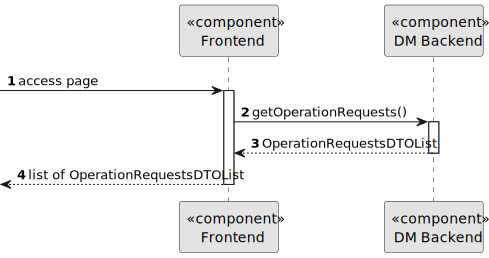

# US 5.1.19

## 1. Context

As a Doctor, I want to list/search operation requisitions, so that I see the details, edit, and remove operation
requisitions.

## 2. Requirements

**US 5.1.19**

**Acceptance Criteria:**

- Doctors can search operation requests by patient name, operation type, priority, and status.
- The system displays a list of operation requests in a searchable and filterable view.
- Each entry in the list includes operation request details (e.g., patient name, operation type, status).
- Doctors can select an operation request to view, update, or delete it.

**Customer Specifications and Clarifications:**

> **Question: None**

**Dependencies/References:**

**There are dependencies to USs 5.1.1.**

* US 5.1.1 - There is the need to be logged and authenticated in the system in order to know the user executing this
  functionality is a Doctor.

**Input and Output Data**

**Input Data:**

* Typed data:
    * Data from which the list of operation requests will be filtered

* Selected data:
    * None

* Generated data:
    * List of filtered Operation Requests

**Output Data:**

* Display the success of the operation and the data of the list of operation request

## 3. Design

**Domain Class/es:** OperationRequest, OperationRequestDto, IOperationRequestRepository

**Controller:** OperationRequestController

**UI:**

**Repository:** OperationRequestRepository, LogRepository

**Service:** OperationRequestService, AuthorizationService, LogService

### 3.1. Sequence Diagram

**Register Patient Level 1**

**Register Patient Level 2**

**Register Patient Level 3**

