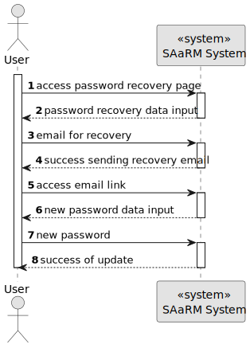
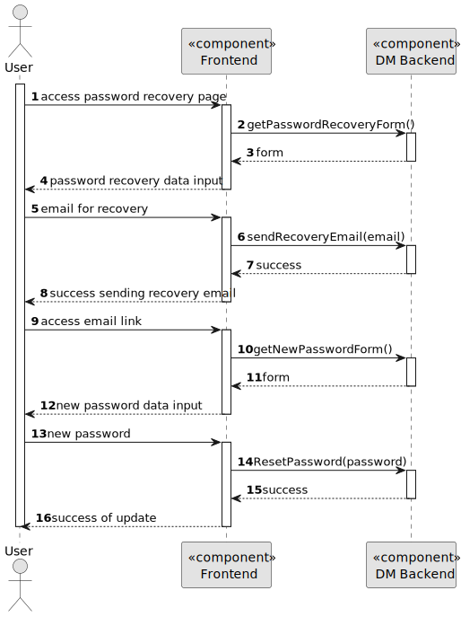
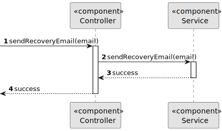
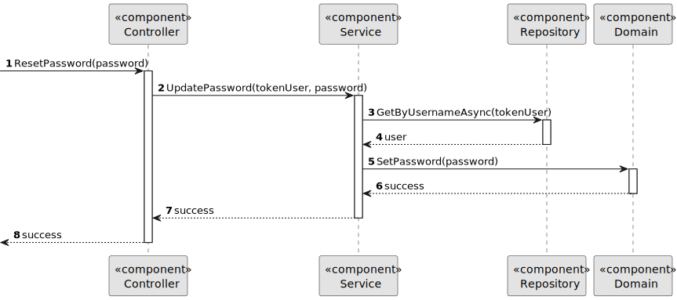

# US 5.1.2

## 1. Context

As part of the development of the software system, it is necessary to implement a functionality that lets a user reset their password.
This is the first time this task has been assigned for development.

## 2. Requirements

**US 5.1.2** 

**Acceptance Criteria:** 

- Backoffice users can request a password reset by providing their email.
- The system sends a password reset link via email.
- The reset link expires after a predefined period (e.g., 24 hours) for security.
- Users must provide a new password that meets the system’s password complexity rules.

**Dependencies/References:**

* There is a dependency to "5.1.1", since is necessary to have a User Account to be able to change its password.

**Input and Output Data**

**Input Data:**

* Typed data:
    * Email
    * Password

**Output Data:**
* Display the success of the sending an Email to the user.
* Display the success of updating the Password after filling the form in the link provided via email.

## 3. Analysis

> **Question:** What are the system's password requirements?
>
> **Answer:** At least 10 characters long, at least a digit, a capital letter and a special character

## 4. Design

**Domain Class/es:** E-mail, User

**Controller:** UserController

**UI:** None

**Repository:**	UserRepository

**Service:** UserManagementService, AuthorizationService

### 4.1. Sequence Diagram

**Level One**

**Level Two**

**Level Three**

