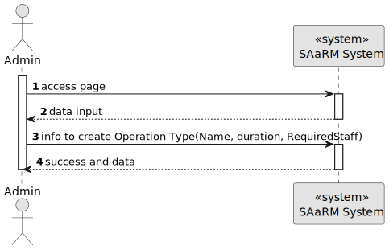
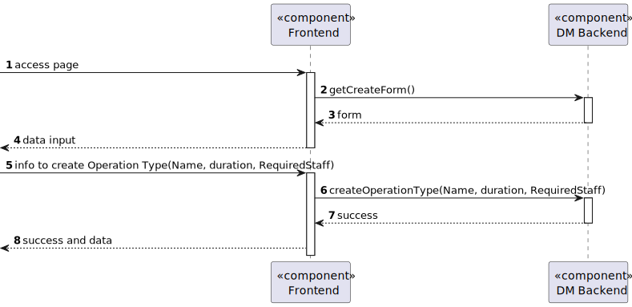
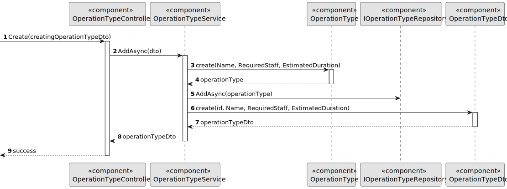

# US 5.1.20

## 1. Context

As part of the development of the software system, it is necessary to implement Operation Requests management functionalities within the Staff interface. These functionalities are essential to allow doctors to update in the system requests of an operation.

## 2. Requirements

**US 5.1.16**

**Acceptance Criteria:**

- Doctors can create an operation request by selecting the patient, operation type, priority, and suggested deadline.
- The system validates that the operation type matches the doctor’s specialization.
- The operation request includes:
- Patient ID
- Doctor ID
- Operation Type
- Deadline
- Priority
- The system confirms successful submission of the operation request and logs the request in
  the patient’s medical history

**Customer Specifications and Clarifications:**

> **Question: In the project document it mentions that each operation has a priority. How is a operation's priority defined? Do they have priority levels defined? Is it a scale? Or any other system?**
>
> **Answer: Elective Surgery: A planned procedure that is not life-threatening and can be scheduled at a convenient time (e.g., joint replacement, cataract surgery).
Urgent Surgery: Needs to be done sooner but is not an immediate emergency. Typically within days (e.g., certain types of cancer surgeries).
Emergency Surgery: Needs immediate intervention to save life, limb, or function. Typically performed within hours (e.g., ruptured aneurysm, trauma).**


**Dependencies/References:**

**There are dependencies to USs 5.1.20, 5.1.12, 5.1.8 and 5.1.1.**

* US 5.1.1 - There is the need to be logged and authenticated in the system in order to know the Doctor who created the Operation Request.
* US 5.1.8 - There is the need for the existence of patients profiles in the system so I can get one to get the Id for the Operation Request.
* US 5.1.12 - There is the need for the existence of staff profiles in the system so I can get the Id of the Doctor fo the Operation Request.
* US 5.1.20 - There is the need for the existence of operations types in the system so I can get the Id of one for the Operation Request.

**Input and Output Data**

**Input Data:**

* Typed data:
  * Id of the Operation Type
  * Id of the Patient
  * Deadline
  * Priority

* Selected data:
  * none

* Gotten from the system
  * Id of the Doctor (from the logged doctor)

* Generated data:
  * Operation Request Id

**Output Data:**
* Display the success of the operation and the data of the created operation request

## 3. Analysis

*?????*


## 4. Design


**Domain Class/es:** Priority, OperationRequest, OperationRequestDto, OperationRequestDto, OperationRequestId, IOperationRequestRepository, ILogRepository, IStaffRepository, IPatientRepository, IOperationTypeRepository

**Controller:** OperationRequestController

**UI:**

**Repository:**	OperationRequestRepository, LogRepository, StaffRepository, PatientRepository, OperationTypeRepository

**Service:** OperationRequestService, AuthorizationService, LogService


### 4.1. Sequence Diagram

**Register Patient Level 1**


**Register Patient Level 2**


**Register Patient Level 3**



### 4.2. Class Diagram


### 4.3. Applied Patterns

### 4.4. Tests

Include here the main tests used to validate the functionality. Focus on how they relate to the acceptance criteria.


**Before Tests** **Setup of Dummy Users**

```
    public static SystemUser dummyUser(final String email, final Role... roles) {
        final SystemUserBuilder userBuilder = new SystemUserBuilder(new NilPasswordPolicy(), new PlainTextEncoder());
        return userBuilder.with(email, "duMMy1", "dummy", "dummy", email).build();
    }

    public static SystemUser crocodileUser(final String email, final Role... roles) {
        final SystemUserBuilder userBuilder = new SystemUserBuilder(new NilPasswordPolicy(), new PlainTextEncoder());
        return userBuilder.with(email, "CroC1_", "Crocodile", "SandTomb", email).withRoles(roles).build();
    }

    private SystemUser getNewUserFirst() {
        return dummyUser("dummy@gmail.com", Roles.ADMIN);
    }

    private SystemUser getNewUserSecond() {
        return crocodileUser("crocodile@gmail.com", Roles.OPERATOR);
    }

```

**Test 1:** *Verifies if Users are equals*


```
@Test
public void verifyIfUsersAreEquals() {
    assertTrue(getNewUserFirst().equals(getNewUserFirst()));
}
````


