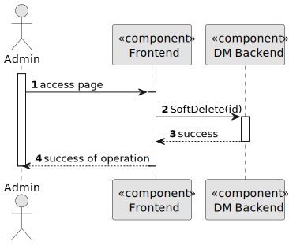
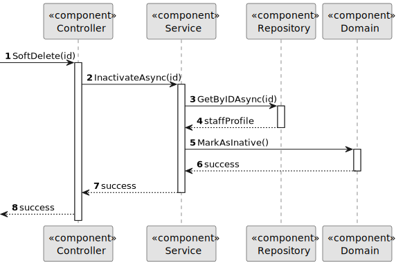

# US 5.1.22


## 1. Context

As part of the development of the software system, it is necessary to implement user management functionalities within the administrative interface. These functionalities are essential to allow administrators to control user access, manage permissions and monitor user activity in the system. This is the first time this task has been assigned for development.

## 2. Requirements

**US 5.1.22** 

**Acceptance Criteria:** 

- Admins can search for and mark operation types as inactive (rather than deleting them) to preserve historical records.
- Inactive operation types are no longer available for future scheduling but remain in historical data.
- A confirmation prompt is shown before deactivating an operation type.


**Customer Specifications and Clarifications:**

> **Question 23:**
>
> **Answer:** 


**Dependencies/References:**

* There is a dependency to "USG007:  "As a Project Manager, I want the system to support and apply authentication and authorization for all its users and functionalities.", since is necessary to be able to Sign Up as admin to create others Users.

**Input and Output Data**

**Input Data:**

* Typed data:
    * First Name
    * Last Name
    * E-mail


* Selected data:
    * User 
    * Role


**Output Data:**
* Display the success of the operation and the data of the registered user (Add User)
* Display the success of the operation and the list the users of the backoffice (List Users)
* Display the success of the operation and the disable or enable action on the specific user (Enable/Disable User)

## 3. Analysis


## 4. Design


**Domain Class/es:** OperationType

**Controller:** OperationTypeController

**UI:** None

**Repository:**	OperationTypeRepository

**Service:** OperationTypeService, AuthorizationService


### 4.1. Sequence Diagram

**Level One**


**Level Two**



**Level Three**



### 4.2. Tests

Include here the main tests used to validate the functionality. Focus on how they relate to the acceptance criteria.


**Before Tests** **Setup of Dummy Users**

```

```

**Test 1:** *Verifies if Users are equals*


```

```


## 5. Implementation


### Methods in OperationTypeController
* **Task<ActionResult<StaffDto>> SoftDelete(string id)**  this method receives the info from the API and redirects it to the Service

### Methods in the OperationTypeService
* **Task<StaffDto> InactivateAsync(string id)** this method deactivates a Staff Profile

### Methods in the OperationTypeRepository
* **Task<StaffProfile> GetByIDAsync(id)** this method retrieves a Staff Profile from the database by its ID

### Methods in the OperationType
* **void MarkAsInative()** this method updates the OperationType's active attribute


## 6. Integration/Demonstration


[//]: # (## 7. Observations)

[//]: # ()
[//]: # (*This section should be used to include any content that does not fit any of the previous sections.*)

[//]: # ()
[//]: # (*The team should present here, for instance, a critical perspective on the developed work including the analysis of alternative solutions or related works*)

[//]: # ()
[//]: # (*The team should include in this section statements/references regarding third party works that were used in the development this work.*)