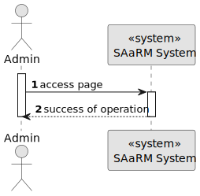

# US 5.1.22

## 1. Context

As part of the development of the software system, it is necessary to implement user management functionalities within the administrative interface. These functionalities are essential to allow administrators to control user access, manage permissions and monitor user activity in the system. This is the first time this task has been assigned for development.

## 2. Requirements

**US 5.1.22** 

**Acceptance Criteria:** 

- Admins can search for and mark operation types as inactive (rather than deleting them) to preserve historical records.
- Inactive operation types are no longer available for future scheduling but remain in historical data.
- A confirmation prompt is shown before deactivating an operation type.

**Dependencies/References:**

* There is a dependency to "USG007:  "As a Project Manager, I want the system to support and apply authentication and authorization for all its users and functionalities.", since is necessary to be able to Sign Up as admin to create others Users.

**Input and Output Data**

**Input Data:**

* Selected data:
    * OperationType

**Output Data:**
* Display the success of the operation

## 3. Analysis

## 4. Design

**Domain Class/es:** OperationType

**Controller:** OperationTypeController

**UI:** None

**Repository:**	OperationTypeRepository

**Service:** OperationTypeService, AuthorizationService

### 4.1. Sequence Diagram

**Level One**

**Level Two**

**Level Three**

## 5. Implementation

### Methods in OperationTypeController
* **Task<ActionResult<StaffDto>> SoftDelete(string id)**  this method receives the info from the API and redirects it to the Service

### Methods in the OperationTypeService
* **Task<StaffDto> InactivateAsync(string id)** this method deactivates a Staff Profile

### Methods in the OperationTypeRepository
* **Task<StaffProfile> GetByIDAsync(id)** this method retrieves a Staff Profile from the database by its ID

### Methods in the OperationType
* **void MarkAsInative()** this method updates the OperationType's active attribute

