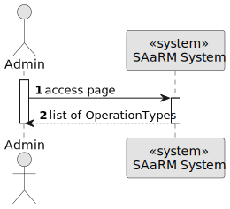

# US 5.1.23


## 1. Context

As part of the development of the software system, it is necessary to implement user management functionalities within the administrative interface. 
These functionalities are essential to allow administrators to view operation types.
This is the first time this task has been assigned for development.

## 2. Requirements

**US 5.1.23**  As an Admin, I want to list/search operation types, so that I can see the details, edit, and remove operation types

**Acceptance Criteria:** 

- Admins can search and filter operation types by name, specialization, or status
  (active/inactive).

- The system displays operation types in a searchable list with attributes such as name, required
  staff, and estimated duration.

- Admins can select an operation type to view, edit, or deactivate it.

**Customer Specifications and Clarifications:**


**Dependencies/References:**

* There is a dependency to "5.1.20 As an Admin, I want to add new types of operations, so that I can reflect the available medical procedures in the system."


**Input and Output Data**

**Input Data:**

* Typed data:
    * name
    * specialization
    * status


**Output Data:**
* Display the success of the operation and the data of the operations types.


## 3. Analysis


[//]: # (### 3.1. Domain Model)

[//]: # (![sub domain model]&#40;us1000-sub-domain-model.svg&#41;)

## 4. Design


**Domain Class/es:** OperationTypes, RequiredStaff

**Controller:** OperationTypesController

**UI:**

**Repository:**	OperationTypesRepository

**Service:** OperationTypesService


### 4.1. Sequence Diagram

**Filter OperationTypes Level 1**




**Filter OperationTypes Level 2**


**Filter OperationTypes Level 3**


[//]: # (![Filter OperationTypes]&#40;sequence-diagram-4.svg "Filter OperationTypes"&#41;)


[//]: # (### 4.2. Class Diagram)

[//]: # ()
[//]: # (![a class diagram]&#40;us1000-class-diagram.svg "A Class Diagram"&#41;)

### 4.2. Applied Patterns

### 4.3. Tests

Include here the main tests used to validate the functionality. Focus on how they relate to the acceptance criteria.


**Before Tests** **Setup of Dummy Users**

```
    public static SystemUser dummyUser(final String email, final Role... roles) {
        final SystemUserBuilder userBuilder = new SystemUserBuilder(new NilPasswordPolicy(), new PlainTextEncoder());
        return userBuilder.with(email, "duMMy1", "dummy", "dummy", email).build();
    }

    public static SystemUser crocodileUser(final String email, final Role... roles) {
        final SystemUserBuilder userBuilder = new SystemUserBuilder(new NilPasswordPolicy(), new PlainTextEncoder());
        return userBuilder.with(email, "CroC1_", "Crocodile", "SandTomb", email).withRoles(roles).build();
    }

    private SystemUser getNewUserFirst() {
        return dummyUser("dummy@gmail.com", Roles.ADMIN);
    }

    private SystemUser getNewUserSecond() {
        return crocodileUser("crocodile@gmail.com", Roles.OPERATOR);
    }

```

**Test 1:** *Verifies if Users are equals*


```
@Test
public void verifyIfUsersAreEquals() {
    assertTrue(getNewUserFirst().equals(getNewUserFirst()));
}
````


[//]: # (## 5. Implementation)

[//]: # ()
[//]: # ()
[//]: # (### Methods in the OperationTypesController)

[//]: # (* **public async Task<ActionResult<IEnumerable<OperationTypeDto>>> GetAllFiltered&#40;)

[//]: # (  [FromQuery] string? name,)

[//]: # (  [FromQuery] string? specialization,)

[//]: # (  [FromQuery] bool? status&#41;**  this method filters to list all operationtypes)

[//]: # ()
[//]: # ()
[//]: # ()
[//]: # ()
[//]: # (## 6. Integration/Demonstration)


[//]: # (## 7. Observations)

[//]: # ()
[//]: # (*This section should be used to include any content that does not fit any of the previous sections.*)

[//]: # ()
[//]: # (*The team should present here, for instance, a critical perspective on the developed work including the analysis of alternative solutions or related works*)

[//]: # ()
[//]: # (*The team should include in this section statements/references regarding third party works that were used in the development this work.*)