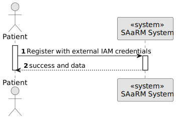
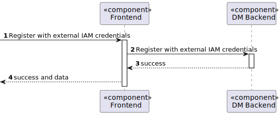

# US 5.1.3


## 1. Context

As part of the development of the software system, it is necessary to implement user management functionalities within the patient interface. These functionalities are essential to allow patients to register in the application and then create a user profile, and book appointmens. 

## 2. Requirements

**US 5.1.3** As a Patient, I want to register for the healthcare application, so that I can create a user profile and book appointments online.

**Acceptance Criteria:** 

- Patients can self-register using the external IAM system.

- During registration, patients provide personal details (e.g., name, email, phone) and create a
profile.

- The system validates the email address by sending a verification email with a confirmation link.
Patients cannot book appointments without completing the registration process.

- Pawword must have at least 10 characters long, at least a digit, a capital letter and a special character

- A patient must be unique in terms of `Medical Record Number`, `Email` and ‘Phone’.

- Sensitive data (like medical history) must comply with GDPR, allowing patients
to control their data access.


- Medical record numbers are generated by the system following the format YYYYMMnnnnnn where YYYY and MM are the year and month of the registration and nnnnnn is a sequential number.


**Customer Specifications and Clarifications:**


**Dependencies/References:**

* There is a dependency to "US 5.1.1- As an Admin, I want to register new backoffice users (e.g., doctors, nurses, technicians, admins) via an out-of-band process, so that they can access the
backoffice system with appropriate permissions."

* There is a dependency to "5.1.6 As a (non-authenticated) Backoffice User, I want to log in to the system using my credentials, so that I can access the backoffice features according to my assigned role."

**Input and Output Data**

**Input Data:**

* Typed data:
    * Full name
    * E-mail (Contact Information)
    * Phone number (Contact Information)
    * UserEmail
    * Date of Birth    
    * Gender

* Selected data:
    * none

* Generated data:
    * Medical Record Number 

**Output Data:**
* Display the success of the operation and the data of the registered patient

## 3. Analysis

> **Question:** What will be the format of the Medical Record Number generated after recording the data?
>
> **Answer:** mMdical record numbers are generated by the system following the format YYYYMMnnnnnn where YYYY and MM are the year and month of the registration and nnnnnn is a sequential number.


> **Question:** From a usability perspective, dates should be presented to the user using the operating system's locale definitions. since for this sprint you are building an API, you should use a standard format like ISO 8601.
>
> **Answer:** mMdical record numbers are generated by the system following the format YYYYMMnnnnnn where YYYY and MM are the year and month of the registration and nnnnnn is a sequential number.


[//]: # ()
[//]: # (### 3.1. Domain Model)

[//]: # (![sub domain model]&#40;us1000-sub-domain-model.svg&#41;)

## 4. Design


**Domain Class/es:** Email, Patient, PatientDto, CreatingPatientDto, PhoneNumber, MedicalRecordNumber

**Controller:** PatientController

**UI:** 

**Repository:**	PatientRepository, LogRepository

**Service:** PatientService, AuthorizationService, LogService


### 4.1. Sequence Diagram

**Register Patient Level 1**



**Register Patient Level 2**


**Register Patient Level 3**


[//]: # (![Register Patient]&#40;sequence-diagram-4.svg "Register Patient"&#41;)


[//]: # (### 4.2. Class Diagram)

[//]: # ()
[//]: # (![a class diagram]&#40;us1000-class-diagram.svg "A Class Diagram"&#41;)

### 4.3. Applied Patterns

### 4.4. Tests

Include here the main tests used to validate the functionality. Focus on how they relate to the acceptance criteria.


**Test 1:** *Postman Test to create a Patient*

```
        // Check that the response status code is 201 (Created)
        pm.test("Status code is 200", function () {
            pm.response.to.have.status(200);
        });

        // Parse the response body as JSON
        const responseJson = pm.response.json();

        // Check if the response contains the 'id' field
        pm.test("Response contains ID", function () {
            pm.expect(responseJson).to.have.property("id");
        });

        // Save the 'id' from the response to an environment variable
        pm.environment.set("patientId", responseJson.id);

        pm.environment.set("patientEmail", responseJson.email.fullEmail);
        pm.environment.set("patientMedicalRecordNumber", responseJson.medicalRecordNumber.number);


{
  "name": "Pedro Doouu",
  "dateOfBirth": "1985-05-20",
  "phone": "932385677",
  "email":"gago3@gmail.com",
  "userEmail": "gago@isep.ipp.pt",

  "emergencyContact": {
    "name": "Jane Doeaeae",
    "phone": "987654321",
    "email":  "janedoe123@example.com"
  },

  "gender": "Female",
  "allergies": [],
  "appointmentHistory": ["2021-09-15", "2022-10-10"]
}

```

**Test 2:** *Verifies if Patient was created*


```
pm.test("Status code is 200", function () {
    pm.response.to.have.status(200);
});

// Parse the response body as JSON
const responseJson = pm.response.json();

// Remove o array e seleciona o primeiro objeto dentro dele
const actualResponse = Array.isArray(responseJson) ? responseJson[0] : responseJson;

const expectedPostResponse = {
    name: {
        "firstName": "Pedro",
        "middleNames": "",
        "lastName": "Doouu"
    },
    id: pm.environment.get("patientId"), // Use the generated ID from the response
    dateOfBirth: "1985-05-20T00:00:00",
    medicalRecordNumber: {
        number: pm.environment.get("patientMedicalRecordNumber") // Example; will be dynamically checked
    },
    gender: "Female",
    allergies: [],
    appointmentHistory: [
        "2021-09-15",
        "2022-10-10"
    ],
    nameEmergency: "default dd",
    phoneEmergency: {
        number: "999999999"
    },
    emailEmergency: {
        fullEmail: "default@gmail.com"
    },
    phone: {
        number: "932385677"
    },
    email: {
        fullEmail: "gago3@gmail.com"
    },
    userEmail: {
        fullEmail: "gago@isep.ipp.pt"
    }
};

// Validate that the retrieved response matches the expected structure
pm.test("Response matches expected structure", function () {
    pm.expect(actualResponse).to.deep.equal(expectedPostResponse);
});

````


````


## 5. Implementation


### Methods in the PatientController
* **public async Task<ActionResult<PatientDto>> Create(CreatingPatientDto dto)**  this method creates the patient with the info fullName,email, phone, gender, dateOfBirth, userEmail


## 6. Integration/Demonstration


[//]: # (## 7. Observations)

[//]: # ()
[//]: # (*This section should be used to include any content that does not fit any of the previous sections.*)

[//]: # ()
[//]: # (*The team should present here, for instance, a critical perspective on the developed work including the analysis of alternative solutions or related works*)

[//]: # ()
[//]: # (*The team should include in this section statements/references regarding third party works that were used in the development this work.*)