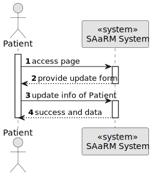
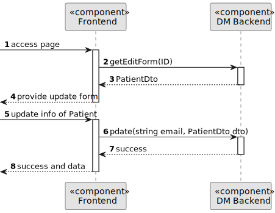
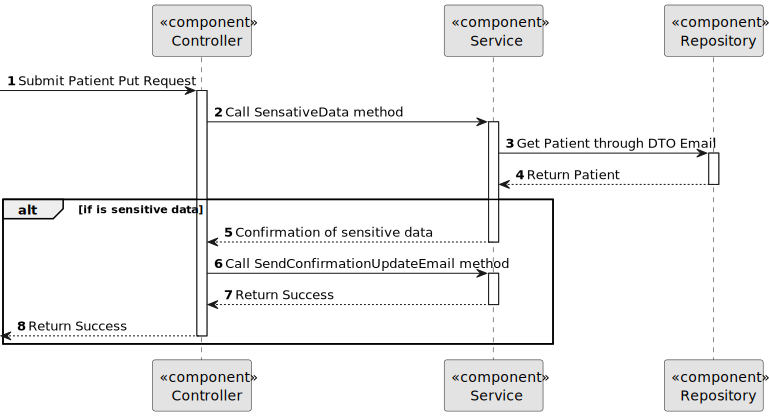
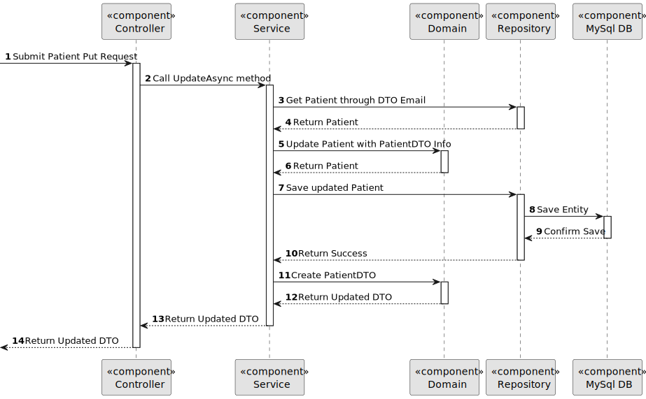

# US 5.1.4


## 1. Context

As part of the development of the software system, it is necessary to implement user management functionalities within the patient interface. These functionalities are essential to allow patients to update their profile in the system.
This is the first time this task has been assigned for development.

## 2. Requirements

**US 5.1.4** As a Patient, I want to update my user profile, so that I can change my personal details and preferences.


**Acceptance Criteria:** 

- Patients can log in and update their profile details (e.g., name, contact information,
preferences).

- Changes to sensitive data, such as email, trigger an additional verification step (e.g.,
confirmation email).

- All profile updates are securely stored in the system.

- The system logs all changes made to the patient's profile for audit purposes.

**Customer Specifications and Clarifications:**

> **Question**: Can patients update both their user and patient profile information?
>
> **Answer**: Patients can update contact information but not medical details. Changes must be verified and validated.


> **Question:** what do preferences mean in the patient profile?
>
> **Answer:** Preferences are for now related to marketing consent or not by the patient, or other related GDPR preferences


**Dependencies/References:**

* There is a dependency to "US 5.1.1- As an Admin, I want to register new backoffice users (e.g., doctors, nurses, technicians, admins) via an out-of-band process, so that they can access the
backoffice system with appropriate permissions."


* There is a dependency to "5.1.6 As a (non-authenticated) Backoffice User, I want to log in to the system using my credentials, so that I can access the backoffice features according to my assigned role."


* There is a dependency to "As a Patient, I want to register for the healthcare application, so that I can create a user profile and book appointments online."

**Input and Output Data**

**Input Data:**

* Typed data:
  * Full name
  * E-mail (Contact Information)
  * Phone number (Contact Information)
  * UserEmail
  * Date of Birth
  * Gender


**Output Data:**
* Display the success of the operation and the data updated.

## 3. Analysis

>
>
>

[//]: # ()
[//]: # (### 3.1. Domain Model)

[//]: # (![sub domain model]&#40;us1000-sub-domain-model.svg&#41;)

## 4. Design


**Domain Class/es:** Email, Patient, MedicalRecordNumber, PhoneNumber, PatientDto

**Controller:** PatientController

**UI:** 

**Repository:**	PatientRepository, LogRepository

**Service:** PatientService, AuthorizationService, LogService, GmailService


### 4.1. Sequence Diagram

**Update Patient Level 1**




**Update Patient Level 2**



**Update Patient Level 3**





[//]: # (![Update Patient]&#40;sequence-diagram-4.svg "Update Patient"&#41;)


[//]: # (### 4.2. Class Diagram)

[//]: # ()
[//]: # (![a class diagram]&#40;us1000-class-diagram.svg "A Class Diagram"&#41;)

### 4.3. Applied Patterns

### 4.4. Tests

Include here the main tests used to validate the functionality. Focus on how they relate to the acceptance criteria.


**Before Tests** **Setup of Dummy Users**

```
    public static SystemUser dummyUser(final String email, final Role... roles) {
        final SystemUserBuilder userBuilder = new SystemUserBuilder(new NilPasswordPolicy(), new PlainTextEncoder());
        return userBuilder.with(email, "duMMy1", "dummy", "dummy", email).build();
    }

    public static SystemUser crocodileUser(final String email, final Role... roles) {
        final SystemUserBuilder userBuilder = new SystemUserBuilder(new NilPasswordPolicy(), new PlainTextEncoder());
        return userBuilder.with(email, "CroC1_", "Crocodile", "SandTomb", email).withRoles(roles).build();
    }

    private SystemUser getNewUserFirst() {
        return dummyUser("dummy@gmail.com", Roles.ADMIN);
    }

    private SystemUser getNewUserSecond() {
        return crocodileUser("crocodile@gmail.com", Roles.OPERATOR);
    }

```

**Test 1:** *Verifies if Users are equals*


```
@Test
public void verifyIfUsersAreEquals() {
    assertTrue(getNewUserFirst().equals(getNewUserFirst()));
}
````


## 5. Implementation


### Methods in the ListUsersController
* **public async Task<ActionResult<PatientDto>> Update(string email, PatientDto dto)**  this method updates the patient info


## 6. Integration/Demonstration


[//]: # (## 7. Observations)

[//]: # ()
[//]: # (*This section should be used to include any content that does not fit any of the previous sections.*)

[//]: # ()
[//]: # (*The team should present here, for instance, a critical perspective on the developed work including the analysis of alternative solutions or related works*)

[//]: # ()
[//]: # (*The team should include in this section statements/references regarding third party works that were used in the development this work.*)