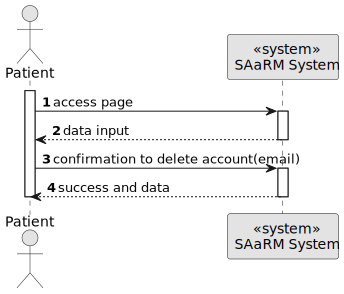
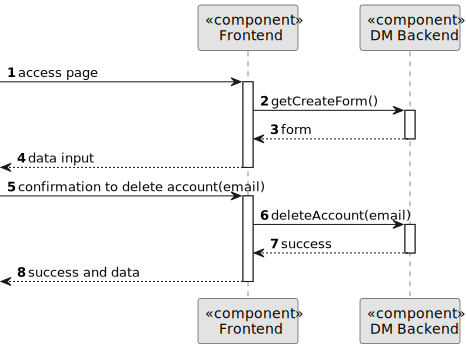
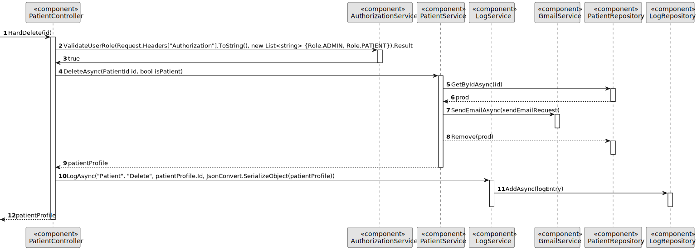

# US 5.1.5


## 1. Context

As part of the development of the software system, it is necessary to implement user management functionalities within the patient interface. These functionalities are essential to allow patients to delete their account and all the data. 
This is the first time this task has been assigned for development.

## 2. Requirements

**US 5.1.5** As a Patient, I want to delete my account and all associated data, so that I can exercise my right to be forgotten as per GDPR.

**Acceptance Criteria:** 

- Patients can request to delete their account through the profile settings.

- The system sends a confirmation email to the patient before proceeding with account deletion.

- Upon confirmation, all personal data is permanently deleted from the system within the legally
required time frame (e.g., 30 days).

- Patients are notified once the deletion is complete, and the system logs the action for GDPR
compliance.

- Some anonymized data may be retained for legal or research purposes, but all identifiable
information is erased.

**Customer Specifications and Clarifications:**

>**Question**: Is removing an operation type the same as deactivating it?
>
> **Answer**: Yes, deactivating makes the operation type unavailable for future use but retains historical data.


**Dependencies/References:**

* There is a dependency to "US 5.1.1- As an Admin, I want to register new backoffice users (e.g., doctors, nurses, technicians, admins) via an out-of-band process, so that they can access the
backoffice system with appropriate permissions."


**Input and Output Data**

**Input Data:**

* Typed data:
    * id
    * Confirmation of the delete operation. 


**Output Data:**
* Display the success of the operation.

## 3. Analysis

>**Question**: What happens to patient data after the profile is deleted?
>
>**Answer**: Patient data must be retained for a legally mandated period before being anonymized or deleted.


[//]: # (### 3.1. Domain Model)

[//]: # (![sub domain model]&#40;us1000-sub-domain-model.svg&#41;)

## 4. Design

**Domain Class/es:** Email, Patient, MedicalRecordNumber, PhoneNumber

**Controller:** PatientController

**UI:**

**Repository:**	PatientRepository, LogsRepository

**Service:** PatientService, AuthorizationService, LogsService, GmailService


### 4.1. Sequence Diagram

**Delete Patient Level 1**




**Update Patient Level 2**



**Update Patient Level 3**



[//]: # ()
[//]: # ()
[//]: # (### 4.2. Class Diagram)

[//]: # ()
[//]: # (![a class diagram]&#40;us1000-class-diagram.svg "A Class Diagram"&#41;)

### 4.3. Applied Patterns

### 4.4. Tests

Include here the main tests used to validate the functionality. Focus on how they relate to the acceptance criteria.


**Before Tests** **Setup of Dummy Users**

```
    public static SystemUser dummyUser(final String email, final Role... roles) {
        final SystemUserBuilder userBuilder = new SystemUserBuilder(new NilPasswordPolicy(), new PlainTextEncoder());
        return userBuilder.with(email, "duMMy1", "dummy", "dummy", email).build();
    }

    public static SystemUser crocodileUser(final String email, final Role... roles) {
        final SystemUserBuilder userBuilder = new SystemUserBuilder(new NilPasswordPolicy(), new PlainTextEncoder());
        return userBuilder.with(email, "CroC1_", "Crocodile", "SandTomb", email).withRoles(roles).build();
    }

    private SystemUser getNewUserFirst() {
        return dummyUser("dummy@gmail.com", Roles.ADMIN);
    }

    private SystemUser getNewUserSecond() {
        return crocodileUser("crocodile@gmail.com", Roles.OPERATOR);
    }

```

**Test 1:** *Verifies if Users are equals*


```
@Test
public void verifyIfUsersAreEquals() {
    assertTrue(getNewUserFirst().equals(getNewUserFirst()));
}
````


## 5. Implementation


### Methods in the ListUsersController
* **Iterable<SystemUser> filteredUsersOfBackOffice()**  this method filters to list all backoffice users


### Methods in the AddUsersController

* **Role[] getRoleTypes()** this method list the roles to choose for the User

* **SystemUser addUser(final String email, final String password, final String firstName,
  final String lastName, final Set<Role> roles, final Calendar createdOn)**  this method send the information to create the User.

* **String generatePassword()** this method automatically generate a password for the User. 


### Methods in the DeactivateUsersController

* **Iterable<SystemUser> activeUsers()** this method list all the activated Users. 

* **Iterable<SystemUser> deactiveUsers()** this method list all the deactivated Users.

* **SystemUser activateUser(final SystemUser user)** this method activate the chosen User.

* **SystemUser deactivateUser(final SystemUser user)** this method deactivate the chosen User. 


## 6. Integration/Demonstration


[//]: # (## 7. Observations)

[//]: # ()
[//]: # (*This section should be used to include any content that does not fit any of the previous sections.*)

[//]: # ()
[//]: # (*The team should present here, for instance, a critical perspective on the developed work including the analysis of alternative solutions or related works*)

[//]: # ()
[//]: # (*The team should include in this section statements/references regarding third party works that were used in the development this work.*)