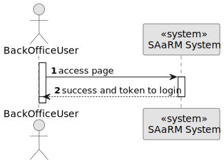
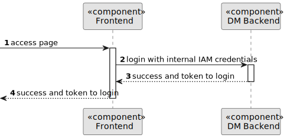

# US 5.1.6


## 1. Context

As part of the development of the software system, it is necessary to implement user management functionalities within the user interface. These functionalities are essential to allow on-authenticated users to log in to the system.
This is the first time this task has been assigned for development.

## 2. Requirements

**US 5.1.6** As a (non-authenticated) Backoffice User, I want to log in to the system using my credentials, so that I can access the backoffice features according to my assigned role. 


**Acceptance Criteria:** 

- Backoffice users log in using their username and password.

- Role-based access control ensures that users only have access to features appropriate to their
role (e.g., doctors can manage appointments, admins can manage users and settings).

- After five failed login attempts, the user account is temporarily locked, and a notification is
sent to the admin.

- Login sessions expire after a period of inactivity to ensure security.

**Customer Specifications and Clarifications:**

> **Question**: What defines session inactivity?
>
> **Answer**: Inactivity is defined as no interaction with the API. After 20 minutes of inactivity, the session should disconnect


**Dependencies/References:**

* There is a dependency to "US 5.1.1- As an Admin, I want to register new backoffice users (e.g., doctors, nurses, technicians, admins) via an out-of-band process, so that they can access the
backoffice system with appropriate permissions."

**Input and Output Data**

**Input Data:**

* Typed data:
    * E-mail
    * Password


**Output Data:**
* Display the success of the operation and the available features.


## 3. Analysis

> **Question**: What defines session inactivity?
>
> **Answer**: Inactivity is defined as no interaction with the API. After 20 minutes of inactivity, the session should disconnect


[//]: # (### 3.1. Domain Model)

[//]: # (![sub domain model]&#40;us1000-sub-domain-model.svg&#41;)

## 4. Design


**Domain Class/es:** Email, User

**Controller:** UserController

**UI:** 

**Repository:**	UserRepository

**Service:** UserService, AuthorizationService


### 4.1. Sequence Diagram

**Login Patient Level 1**




**Login Patient Level 2**



**Login Patient Level 3**


[//]: # (![Login Patient]&#40;sequence-diagram-4.svg "Login Patient"&#41;)


[//]: # ()
[//]: # (### 4.2. Class Diagram)

[//]: # ()
[//]: # (![a class diagram]&#40;us1000-class-diagram.svg "A Class Diagram"&#41;)

[//]: # (### 4.3. Applied Patterns)

[//]: # ()
[//]: # (### 4.4. Tests)

[//]: # ()
[//]: # (Include here the main tests used to validate the functionality. Focus on how they relate to the acceptance criteria.)

[//]: # ()
[//]: # ()
[//]: # ()
[//]: # (**Before Tests** **Setup of Dummy Users**)

[//]: # ()
[//]: # (```)

[//]: # (    public static SystemUser dummyUser&#40;final String email, final Role... roles&#41; {)

[//]: # (        final SystemUserBuilder userBuilder = new SystemUserBuilder&#40;new NilPasswordPolicy&#40;&#41;, new PlainTextEncoder&#40;&#41;&#41;;)

[//]: # (        return userBuilder.with&#40;email, "duMMy1", "dummy", "dummy", email&#41;.build&#40;&#41;;)

[//]: # (    })

[//]: # ()
[//]: # (    public static SystemUser crocodileUser&#40;final String email, final Role... roles&#41; {)

[//]: # (        final SystemUserBuilder userBuilder = new SystemUserBuilder&#40;new NilPasswordPolicy&#40;&#41;, new PlainTextEncoder&#40;&#41;&#41;;)

[//]: # (        return userBuilder.with&#40;email, "CroC1_", "Crocodile", "SandTomb", email&#41;.withRoles&#40;roles&#41;.build&#40;&#41;;)

[//]: # (    })

[//]: # ()
[//]: # (    private SystemUser getNewUserFirst&#40;&#41; {)

[//]: # (        return dummyUser&#40;"dummy@gmail.com", Roles.ADMIN&#41;;)

[//]: # (    })

[//]: # ()
[//]: # (    private SystemUser getNewUserSecond&#40;&#41; {)

[//]: # (        return crocodileUser&#40;"crocodile@gmail.com", Roles.OPERATOR&#41;;)

[//]: # (    })

[//]: # ()
[//]: # (```)

[//]: # ()
[//]: # (**Test 1:** *Verifies if Users are equals*)

[//]: # ()
[//]: # ()
[//]: # (```)

[//]: # (@Test)

[//]: # (public void verifyIfUsersAreEquals&#40;&#41; {)

[//]: # (    assertTrue&#40;getNewUserFirst&#40;&#41;.equals&#40;getNewUserFirst&#40;&#41;&#41;&#41;;)

[//]: # (})

[//]: # (````)

[//]: # ()
[//]: # (## 5. Implementation)

[//]: # ()
[//]: # ()
[//]: # (### Methods in the tUsersController)

[//]: # (* **Login&#40;LoginRequest login&#41;**  this method verifies the username and password from a user)

[//]: # ()


[//]: # ()
[//]: # ()
[//]: # (## 6. Integration/Demonstration)

[//]: # ()


[//]: # (## 7. Observations)

[//]: # ()
[//]: # (*This section should be used to include any content that does not fit any of the previous sections.*)

[//]: # ()
[//]: # (*The team should present here, for instance, a critical perspective on the developed work including the analysis of alternative solutions or related works*)

[//]: # ()
[//]: # (*The team should include in this section statements/references regarding third party works that were used in the development this work.*)