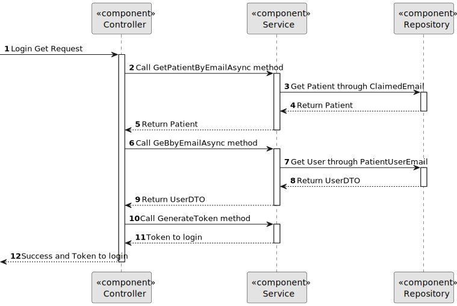

# US 5.1.7


## 1. Context

As a Patient, I want to log in to the healthcare system using my external IAM credentials, so that I can access my appointments, medical records, and other features securely.

## 2. Requirements

**US 5.1.7** 

**Acceptance Criteria:** 

- Patients log in via an external Identity and Access Management (IAM) provider (e.g., Google, Facebook, or hospital SSO). 
- After successful authentication via the IAM, patients are redirected to the healthcare system with a valid session.
- Patients have access to their appointment history, medical records, and other features relevant to their profile.
- Sessions expire after a defined period of inactivity, requiring reauthentication

**Customer Specifications and Clarifications:**

> **Question 1: In IAM external system, if a patient is signed in with a google account and later uses other external system like Facebook, and both have different credentials, what happens?**
>
> **Answer 1 : Assume the system only supports one IAM** 


**Dependencies/References:**

* There is a dependency to "US 5.1.1 - As an Admin, I want to register new backoffice users (e.g., doctors, nurses, technicians, admins) via an out-of-band process, so that they can access the backoffice system with appropriate permissions."

* There is a dependency to "US 5.1.3 - As a Patient, I want to register for the healthcare application, so that I can create a user profile and book appointments online."

**Input and Output Data**

**Input Data:**

* Typed data:
    * None


* Selected data:
    * The gmail account


**Output Data:**
* Display the success of the operation and the token of the signed user (Login with external IAM credentials)

## 3. Analysis


> **Answer:** Some of you have been questioning about the IAM (Identity and Authentication Module). To clarify the scope of the project regarding this topic:
the team is free to decide if they will use an external or an internal IAM
there is just one IAM in the system. that is all users, no matter if they are staff or patients use the same IAM


[//]: # (### 3.1. Domain Model)

[//]: # (![sub domain model]&#40;us1000-sub-domain-model.svg&#41;)

## 4. Design


**Domain Class/es:** User, Patient

**Controller:** PatientController

**UI:**

**Repository:**	UserRepository, PatientRepository

**Service:** PatientService, AuthorizationService


### 4.1. Sequence Diagram

#### Login with external IAM Credentials

**Sequence Diagram Level 1**


**Sequence Diagram Level 2**


**Sequence Diagram Level 3**




[//]: # (### 4.2. Class Diagram)

[//]: # ()
[//]: # (![a class diagram]&#40;us1000-class-diagram.svg "A Class Diagram"&#41;)

### 4.2. Applied Patterns

### 4.3. Tests

Include here the main tests used to validate the functionality. Focus on how they relate to the acceptance criteria.


**Before Tests** **Setup of Dummy Users**

```
    public static SystemUser dummyUser(final String email, final Role... roles) {
        final SystemUserBuilder userBuilder = new SystemUserBuilder(new NilPasswordPolicy(), new PlainTextEncoder());
        return userBuilder.with(email, "duMMy1", "dummy", "dummy", email).build();
    }

    public static SystemUser crocodileUser(final String email, final Role... roles) {
        final SystemUserBuilder userBuilder = new SystemUserBuilder(new NilPasswordPolicy(), new PlainTextEncoder());
        return userBuilder.with(email, "CroC1_", "Crocodile", "SandTomb", email).withRoles(roles).build();
    }

    private SystemUser getNewUserFirst() {
        return dummyUser("dummy@gmail.com", Roles.ADMIN);
    }

    private SystemUser getNewUserSecond() {
        return crocodileUser("crocodile@gmail.com", Roles.OPERATOR);
    }

```

**Test 1:** *Verifies if Users are equals*


```
@Test
public void verifyIfUsersAreEquals() {
    assertTrue(getNewUserFirst().equals(getNewUserFirst()));
}
````


[//]: # (## 5. Implementation)

[//]: # ()
[//]: # ()
[//]: # (### Methods in the ListUsersController)

[//]: # (* **Iterable<SystemUser> filteredUsersOfBackOffice&#40;&#41;**  this method filters to list all backoffice users)

[//]: # ()
[//]: # ()
[//]: # ()
[//]: # (### Methods in the AddUsersController)

[//]: # ()
[//]: # (* **Role[] getRoleTypes&#40;&#41;** this method list the roles to choose for the User)

[//]: # ()
[//]: # (* **SystemUser addUser&#40;final String email, final String password, final String firstName,)

[//]: # (  final String lastName, final Set<Role> roles, final Calendar createdOn&#41;**  this method send the information to create the User.)

[//]: # ()
[//]: # (* **String generatePassword&#40;&#41;** this method automatically generate a password for the User. )

[//]: # ()
[//]: # ()
[//]: # ()
[//]: # (### Methods in the DeactivateUsersController)

[//]: # ()
[//]: # (* **Iterable<SystemUser> activeUsers&#40;&#41;** this method list all the activated Users. )

[//]: # ()
[//]: # (* **Iterable<SystemUser> deactiveUsers&#40;&#41;** this method list all the deactivated Users.)

[//]: # ()
[//]: # (* **SystemUser activateUser&#40;final SystemUser user&#41;** this method activate the chosen User.)

[//]: # ()
[//]: # (* **SystemUser deactivateUser&#40;final SystemUser user&#41;** this method deactivate the chosen User. )

[//]: # ()
[//]: # ()
[//]: # (## 6. Integration/Demonstration)


[//]: # (## 7. Observations)

[//]: # ()
[//]: # (*This section should be used to include any content that does not fit any of the previous sections.*)

[//]: # ()
[//]: # (*The team should present here, for instance, a critical perspective on the developed work including the analysis of alternative solutions or related works*)

[//]: # ()
[//]: # (*The team should include in this section statements/references regarding third party works that were used in the development this work.*)