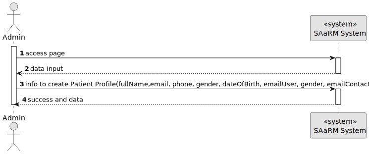
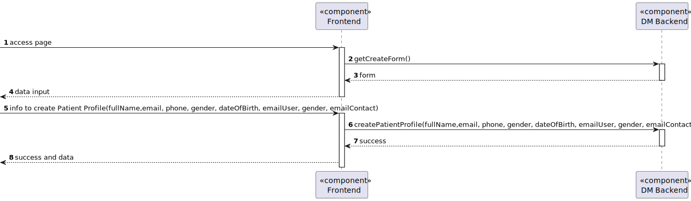

# US 5.1.8


## 1. Context

As an Admin, I want to create a new patient profile, so that I can register their personal details and medical history

## 2. Requirements

**US 5.1.8** 

**Acceptance Criteria:** 

- Admins can input patient details such as first name, last name, date of birth, contact information, and medical history.
- A unique patient ID (Medical Record Number) is generated upon profile creation.
- The system validates that the patient’s email and phone number are unique.
- The profile is stored securely in the system, and access is governed by role-based permissions.

**Customer Specifications and Clarifications:**

> **Question 1: When an Admin creates a patient profile, should he already register them in the system, as users that can login, or should the registration always be responsibility of the patient? If the latter is intended, should the patient's user credentials be linked to the existing profile?**
>
> **Answer 1: Registering a patient record is a separate action from the patient self-registering as a user** 

> **Question 2: I understand that the Admin can create the Patient profile and leave the User as inactive, but how does the activation happen? If that pacient eventualy wants to register himself, should there be an option to activate an existing profile? For example, associate the e-mail from registration input with the existing profile's e-mail? The feature 5.1.3 asks for the full registration, but doesn't say anything about profiles that already exist.**
>
> **Answer 2: the admin register the patient (this does not create a user for that patient) optionally, the patient self-registers in the system by providing the same email that is currently recorded in their patient record and the system associates the user and the patient there is no option for someone who is not a patient of the system to register as a user** 

> **Question 3: It is specified that the admin can input some of the patient's information (name, date of birth, contact information, and medical history). Do they also input the omitted information (gender, emergency contact and allergies/medical condition)? Additionally, does the medical history that the admin inputs refer to the patient's medical record, or is it referring to the appointment history?**
>
> **Answer 3: The admin can not input medical history nor allergies. they can however input gender and emergency contact.** 

> **Question 4: When the administrator starts creating the patient profile, what format(s) of the date of birth will they need to enter? Furthermore, what will be the format of the Medical Record Number generated after recording the data?**
>
> **Answer 4:From a usability perspective, dates should be presented to the user using the operating system's locale definitions. since for this sprint you are building an API, you should use a standard format like ISO 8601. Medical record numbers are generated by the system following the format YYYYMMnnnnnn where YYYY and MM are the year and month of the registration and nnnnnn is a sequential number** 

> **Question 5:So, when the administrator starts creating the patient profile, what format(s) of the date of birth will they need to enter? Furthermore, what will be the format of the Medical Record Number generated after recording the data?**
>
> **Answer 5:From a usability perspective, dates should be presented to the user using the operating system's locale definitions. since for this sprint you are building an API, you should use a standard format like ISO 8601. Medical record numbers are generated by the system following the format YYYYMMnnnnnn where YYYY and MM are the year and month of the registration and nnnnnn is a sequential number** 

> **Question 6:**
>
> **Answer 6:**

**Dependencies/References:**


* There is a dependency to "US 5.1.1 - As an Admin, I want to register new backoffice users (e.g., doctors, nurses, technicians, admins) via an out-of-band process, so that they can access the backoffice system with appropriate permissions."

* There is a dependency to "US 5.1.6 - As a (non-authenticated) Backoffice User, I want to log in to the system using my credentials, so that I can access the backoffice features according to my assigned role."


**Input and Output Data**

**Input Data:**

* Typed data:
    * Full Name
    * E-mail User
    * E-mail
    * Phone
    * Gender
    * Date of Birth
    * AppointmentHistory
    * Emergency Contact
  
* Generated data:
  * Patient Profile Id
  * Medical Record Number


**Output Data:**
* Display the success of the operation and the data of the registered patient (Add Patient)

## 3. Analysis

> **Question 1: is specified that the admin can input some of the patient's information (name, date of birth, contact information, and medical history). Do they also input the omitted information (gender, emergency contact and allergies/medical condition)?
Additionally, does the medical history that the admin inputs refer to the patient's medical record, or is it referring to the appointment history?** 
> 
> **Answer 1: the admin can not input medical history nor allergies. they can however input gender and emergency contact** 

[//]: # (### 3.1. Domain Model)

[//]: # (![sub domain model](us1000-sub-domain-model.svg))

## 4. Design

**Domain Class/es:** Email, Patient, PatientDto, CreatingPatientDto, PhoneNumber, MedicalRecordNumber

**Controller:** PatientController

**UI:**

**Repository:**	PatientRepository, LogRepository

**Service:** PatientService, AuthorizationService, LogService


### 4.1. Sequence Diagram

#### Create Patient Profile

**Sequence Diagram Level 1**



**Sequence Diagram Level 2**



**Sequence Diagram Level 3**


[//]: # (TODO: Necessario fazer algo ?)
### 4.2. Applied Patterns

### 4.3. Tests

Include here the main tests used to validate the functionality. Focus on how they relate to the acceptance criteria.


**Before Tests** **Setup of Dummy Users**

```
    public static SystemUser dummyUser(final String email, final Role... roles) {
        final SystemUserBuilder userBuilder = new SystemUserBuilder(new NilPasswordPolicy(), new PlainTextEncoder());
        return userBuilder.with(email, "duMMy1", "dummy", "dummy", email).build();
    }

    public static SystemUser crocodileUser(final String email, final Role... roles) {
        final SystemUserBuilder userBuilder = new SystemUserBuilder(new NilPasswordPolicy(), new PlainTextEncoder());
        return userBuilder.with(email, "CroC1_", "Crocodile", "SandTomb", email).withRoles(roles).build();
    }

    private SystemUser getNewUserFirst() {
        return dummyUser("dummy@gmail.com", Roles.ADMIN);
    }

    private SystemUser getNewUserSecond() {
        return crocodileUser("crocodile@gmail.com", Roles.OPERATOR);
    }

```

**Test 1:** *Verifies if Users are equals*


```
@Test
public void verifyIfUsersAreEquals() {
    assertTrue(getNewUserFirst().equals(getNewUserFirst()));
}
````


[//]: # (## 5. Implementation)

[//]: # ()
[//]: # ()
[//]: # (### Methods in the ListUsersController)

[//]: # (* **Iterable<SystemUser> filteredUsersOfBackOffice&#40;&#41;**  this method filters to list all backoffice users)

[//]: # ()
[//]: # ()
[//]: # ()
[//]: # (### Methods in the AddUsersController)

[//]: # ()
[//]: # (* **Role[] getRoleTypes&#40;&#41;** this method list the roles to choose for the User)

[//]: # ()
[//]: # (* **SystemUser addUser&#40;final String email, final String password, final String firstName,)

[//]: # (  final String lastName, final Set<Role> roles, final Calendar createdOn&#41;**  this method send the information to create the User.)

[//]: # ()
[//]: # (* **String generatePassword&#40;&#41;** this method automatically generate a password for the User. )

[//]: # (k)

[//]: # ()
[//]: # ()
[//]: # (### Methods in the DeactivateUsersController)

[//]: # ()
[//]: # (* **Iterable<SystemUser> activeUsers&#40;&#41;** this method list all the activated Users. )

[//]: # ()
[//]: # (* **Iterable<SystemUser> deactiveUsers&#40;&#41;** this method list all the deactivated Users.)

[//]: # ()
[//]: # (* **SystemUser activateUser&#40;final SystemUser user&#41;** this method activate the chosen User.)

[//]: # ()
[//]: # (* **SystemUser deactivateUser&#40;final SystemUser user&#41;** this method deactivate the chosen User. )

[//]: # ()
[//]: # ()
[//]: # (## 6. Integration/Demonstration)


[//]: # (## 7. Observations)

[//]: # ()
[//]: # (*This section should be used to include any content that does not fit any of the previous sections.*)

[//]: # ()
[//]: # (*The team should present here, for instance, a critical perspective on the developed work including the analysis of alternative solutions or related works*)

[//]: # ()
[//]: # (*The team should include in this section statements/references regarding third party works that were used in the development this work.*)