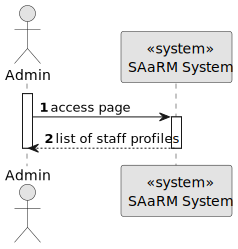
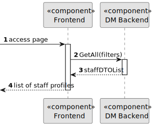
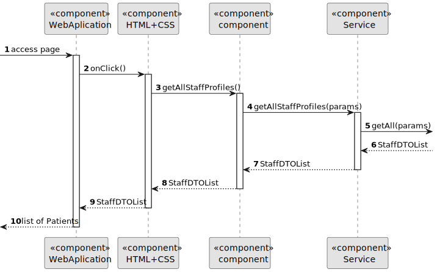

# US 6.2.13


## 1. Context

As part of the development of the software system, it is necessary to implement user management functionalities within the administrative interface. These functionalities are essential to allow administrators to control user access, manage permissions and monitor user activity in the system. This is the first time this task has been assigned for development.
This is the first time this task has been assigned for development.

## 2. Requirements

**US 6.2.13** As an Admin, I want to list/search staff profiles, so that I can see the details, edit, and remove staff profiles.


**Acceptance Criteria:**

- Admins can search staff profiles by attributes such as name, email, or specialization.
- The system displays search results in a list view with key staff information (name, email, specialization).
- Admins can select a profile from the list to view, edit, or deactivate.
- The search results are paginated, and filters are available for refining the search results.


**Customer Specifications and Clarifications:**

**Dependencies/References:**

* This US depends on US 5.1.15.

**Input and Output Data**

**Input Data:**

* Typed data:
  * Filters:
    * Name
    * Email


* Selected data:
  * Filters:
    * Role
    * Specialization


**Output Data:**
* Display the success of the operation and the list of Staff Profiles.


## 3. Analysis

[//]: # (### 3.1. Domain Model)

[//]: # (![sub domain model]&#40;us1000-sub-domain-model.svg&#41;)

## 4. Design

**Domain Class/es:** Staff

**Controller:** StaffController

**UI:** Admin.component

**Repository:**	StaffRepository

**Service:** StaffService, AuthorizationService


### 4.1. Sequence Diagram

**Register User Level 1**



**Register User Level 2**



**Register User Level 3**




[//]: # (### 4.2. Class Diagram)

[//]: # ()
[//]: # (![a class diagram]&#40;us1000-class-diagram.svg "A Class Diagram"&#41;)
[//]: # ()
[//]: # (### 4.3. Applied Patterns)

[//]: # ()
[//]: # (### 4.4. Tests)

[//]: # ()
[//]: # (Include here the main tests used to validate the functionality. Focus on how they relate to the acceptance criteria.)

[//]: # ()
[//]: # ()
[//]: # ()
[//]: # (**Before Tests** **Setup of Dummy Users**)

[//]: # ()
[//]: # (```)

[//]: # (    public static SystemUser dummyUser&#40;final String email, final Role... roles&#41; {)

[//]: # (        final SystemUserBuilder userBuilder = new SystemUserBuilder&#40;new NilPasswordPolicy&#40;&#41;, new PlainTextEncoder&#40;&#41;&#41;;)

[//]: # (        return userBuilder.with&#40;email, "duMMy1", "dummy", "dummy", email&#41;.build&#40;&#41;;)

[//]: # (    })

[//]: # ()
[//]: # (    public static SystemUser crocodileUser&#40;final String email, final Role... roles&#41; {)

[//]: # (        final SystemUserBuilder userBuilder = new SystemUserBuilder&#40;new NilPasswordPolicy&#40;&#41;, new PlainTextEncoder&#40;&#41;&#41;;)

[//]: # (        return userBuilder.with&#40;email, "CroC1_", "Crocodile", "SandTomb", email&#41;.withRoles&#40;roles&#41;.build&#40;&#41;;)

[//]: # (    })

[//]: # ()
[//]: # (    private SystemUser getNewUserFirst&#40;&#41; {)

[//]: # (        return dummyUser&#40;"dummy@gmail.com", Roles.ADMIN&#41;;)

[//]: # (    })

[//]: # ()
[//]: # (    private SystemUser getNewUserSecond&#40;&#41; {)

[//]: # (        return crocodileUser&#40;"crocodile@gmail.com", Roles.OPERATOR&#41;;)

[//]: # (    })

[//]: # ()
[//]: # (```)

[//]: # ()
[//]: # (**Test 1:** *Verifies if Users are equals*)

[//]: # ()
[//]: # ()
[//]: # (```)

[//]: # (@Test)

[//]: # (public void verifyIfUsersAreEquals&#40;&#41; {)

[//]: # (    assertTrue&#40;getNewUserFirst&#40;&#41;.equals&#40;getNewUserFirst&#40;&#41;&#41;&#41;;)

[//]: # (})

[//]: # (````)

[//]: # ()
[//]: # (## 5. Implementation)

[//]: # ()
[//]: # ()
[//]: # (### Methods in the UsersController)

[//]: # (* **public async Task<ActionResult<UserDto>> Create&#40;CreatingUserDto dto&#41;**  this method creates a user)

[//]: # ()
[//]: # ()
[//]: # ()
[//]: # (## 6. Integration/Demonstration)

[//]: # ()


[//]: # (## 7. Observations)

[//]: # ()
[//]: # (*This section should be used to include any content that does not fit any of the previous sections.*)

[//]: # ()
[//]: # (*The team should present here, for instance, a critical perspective on the developed work including the analysis of alternative solutions or related works*)

[//]: # ()
[//]: # (*The team should include in this section statements/references regarding third party works that were used in the development this work.*)