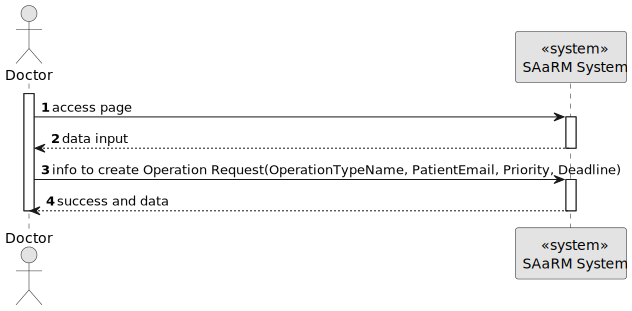
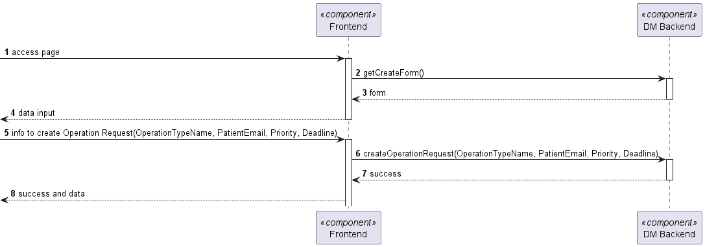
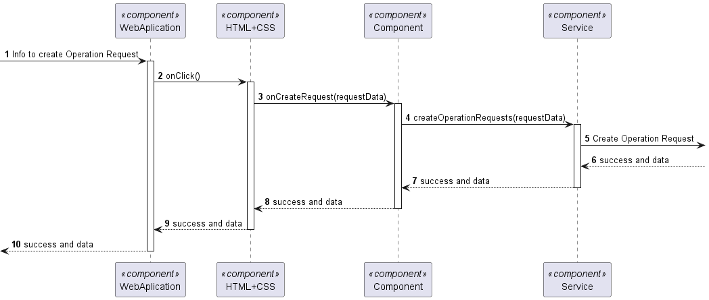

# US 6.2.14

## 1. Context

As a Doctor, I want to request an operation, so that the Patient has access to the necessary healthcare

## 2. Requirements

**US 6.2.14**

**Acceptance Criteria:**

- Doctors can update operation requests they created (e.g., change the deadline or priority).
- The system checks that only the requesting doctor can update the operation request.
- The system logs all updates to the operation request (e.g., changes to priority or deadline).
- Updated requests are reflected immediately in the system and notify the Planning Module of
  any changes.

**Customer Specifications and Clarifications:**

> **Question: None**

**Dependencies/References:**

* US 5.1.1 - There is the need to be logged and authenticated in the system in order to know the user executing this
  functionality is a Doctor.

* There is a dependency to "US 5.1.16 - This functionality need to be implemented so this US works
**Input and Output Data**

**Input Data:**

* Typed data:
  * Patient Email
  * Operation Type Name
  * Deadline
  * Priority

* Gotten from the system
  * Id of the Doctor (from the logged doctor)

* Generated data:
  * New Operation Request

**Output Data:**
* Display the success of the operation and the data of the created operation request

## 3. Design

**Files:** operationRequest.service.ts - auth.service.ts - modal.service.ts - doctor.component.ts -
doctor.component.html - doctor.component.scss

### 3.1. Sequence Diagram

**Register Patient Level 1**

**Register Patient Level 2**

**Register Patient Level 3**

