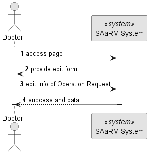
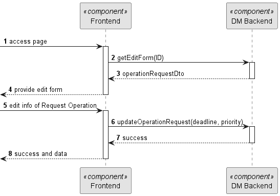
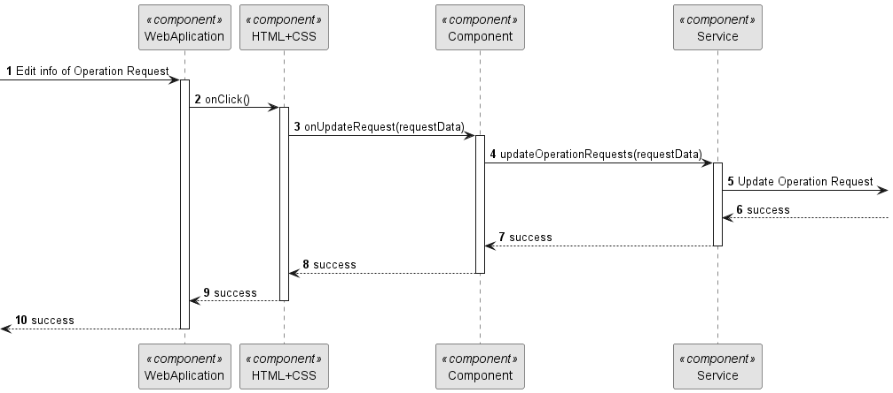

# US 6.2.15

## 1. Context

As a Doctor, I want to update an operation requisition, so that the Patient has access to the necessary healthcare.
## 2. Requirements

**US 6.2.15**

**Acceptance Criteria:**

- Doctors can search operation requests by patient name, operation type, priority, and status.
- The system displays a list of operation requests in a searchable and filterable view.
- Each entry in the list includes operation request details (e.g., patient name, operation type, status).
- Doctors can select an operation request to view, update, or delete it.

**Customer Specifications and Clarifications:**

> **Question: None**

* US 5.1.1 - There is the need to be logged and authenticated in the system in order to know the user executing this
  functionality is a Doctor.

* There is a dependency to "US 5.1.17 - This functionality need to be implemented so this US works
  **Input and Output Data**

**Input Data:**

* Typed data:
  * Deadline
  * Priority

* Generated data:
  * New Operation Request with updated values

**Output Data:**
* Display the success of the operation and the data of the updated operation request

## 3. Design

**Files:** operationRequest.service.ts - auth.service.ts - modal.service.ts - doctor.component.ts -
doctor.component.html - doctor.component.scss

### 3.1. Sequence Diagram

**Register Patient Level 1**

**Register Patient Level 2**

**Register Patient Level 3**

