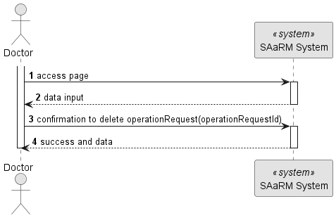
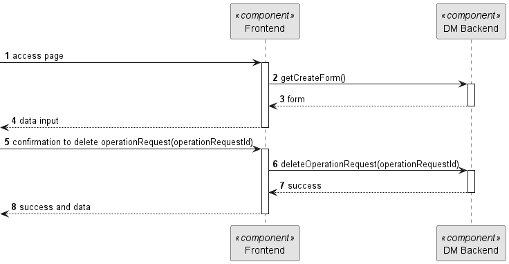
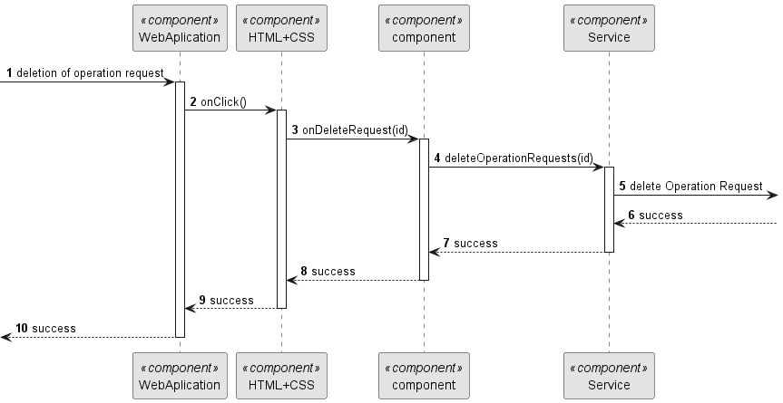

# US 6.2.16

## 1. Context

As a Doctor, I want to remove an operation requisition, so that the healthcare activities are provided as necessary.## 2. Requirements

**US 6.2.16**

**Acceptance Criteria:**

- Doctors can delete operation requests they created if the operation has not yet been scheduled.
- A confirmation prompt is displayed before deletion.
- Once deleted, the operation request is removed from the patient’s medical record and cannot be recovered.
- The system notifies the Planning Module and updates any schedules that were relying on this request.

**Customer Specifications and Clarifications:**

> **Question: None**

* US 5.1.1 - There is the need to be logged and authenticated in the system in order to know the user executing this
  functionality is a Doctor.

* There is a dependency to "US 5.1.18 - This functionality need to be implemented so this US works
  **Input and Output Data**

**Input Data:**

* Selected Data data:
  * Operation Request to be deleted

**Output Data:**
* Display the success of the operation and the data of the deleted operation request

## 3. Design

**Files:** operationRequest.service.ts - auth.service.ts - modal.service.ts - doctor.component.ts -
doctor.component.html - doctor.component.scss

### 3.1. Sequence Diagram

**Register Patient Level 1**

**Register Patient Level 2**

**Register Patient Level 3**

