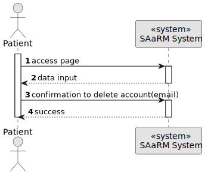
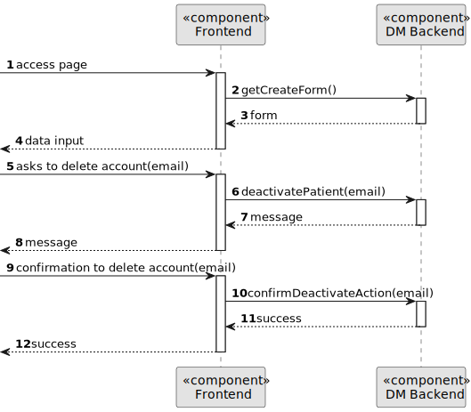
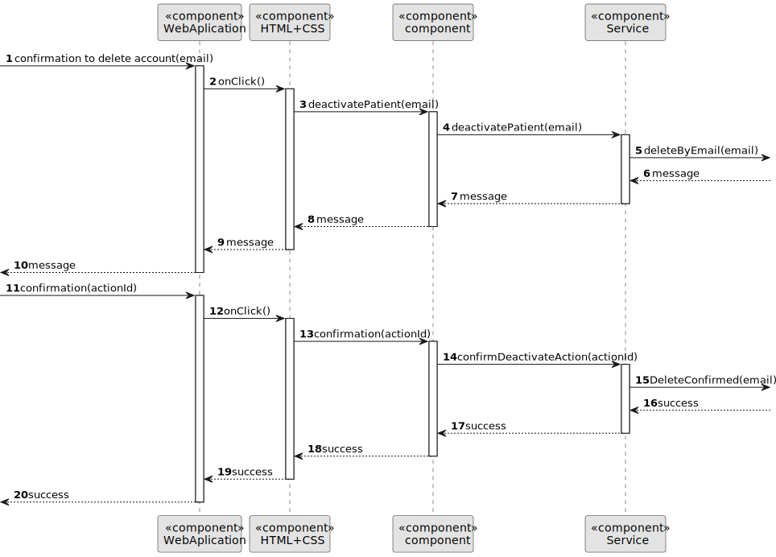

# US 6.2.3


## 1. Context

As part of the development of the software system, it is necessary to implement user management functionalities within the administrative interface. These functionalities are essential to allow patients to delete their account and all the data. 

## 2. Requirements

**US 6.2.3** As a Patient, I want to delete my account and all associated data, so that I can exercise my right to be forgotten as per GDPR.


**Acceptance Criteria:** 


- Patients can request to delete their account through the profile settings.

- The system sends a confirmation email to the patient before proceeding with account deletion.

- Upon confirmation, all personal data is permanently deleted from the system within the legally
required time frame (e.g., 30 days).

- Patients are notified once the deletion is complete, and the system logs the action for GDPR
compliance.

- Some anonymized data may be retained for legal or research purposes, but all identifiable
information is erased.


**Customer Specifications and Clarifications:**

> **Question:** 
>
>**Answer:** 

**Dependencies/References:**

* There is a dependency to "US 5.1.1- As an Admin, I want to register new backoffice users (e.g., doctors, nurses, technicians, admins) via an out-of-band process, so that they can access the
backoffice system with appropriate permissions."


* There is a dependency to "5.1.4 As a Patient, I want to update my user profile, so that I can change my personal details and preferences."


* There is a dependency to "5.1.3 As a Patient, I want to register for the healthcare application, so that I can create a user profile and book appointments online."


* There is a dependency to "5.1.6 As a (non-authenticated) Backoffice User, I want to log in to the system using my credentials, so that I can access the backoffice features according to my assigned role."


* There is a dependency to "5.1.5 As a Patient, I want to delete my account and all associated data, so that I can exercise my right to be forgotten as per GDPR."


**Input and Output Data**

**Input Data:**

* Typed data:
    * Id


**Output Data:**
* Display the success of the operation.


## 3. Analysis

> **Question:** 
>
>**Answer:** 


[//]: # (### 3.1. Domain Model)

[//]: # (![sub domain model]&#40;us1000-sub-domain-model.svg&#41;)

## 4. Design


**Domain Class/es:** Email, User, UserDto, Role

**Controller:** UserController

**UI:** 

**Repository:**	UserRepository

**Service:** UserService, AuthorizationService


### 4.1. Sequence Diagram

**Deactivate Patient Level 1**



**Deactivate Patient Level 2**



**Deactivate Patient Level 3**




[//]: # (### 4.2. Class Diagram)

[//]: # ()
[//]: # (![a class diagram]&#40;us1000-class-diagram.svg "A Class Diagram"&#41;)
[//]: # ()
[//]: # (### 4.3. Applied Patterns)

[//]: # ()
[//]: # (### 4.4. Tests)

[//]: # ()
[//]: # (Include here the main tests used to validate the functionality. Focus on how they relate to the acceptance criteria.)

[//]: # ()
[//]: # ()
[//]: # ()
[//]: # (**Before Tests** **Setup of Dummy Users**)

[//]: # ()
[//]: # (```)

[//]: # (    public static SystemUser dummyUser&#40;final String email, final Role... roles&#41; {)

[//]: # (        final SystemUserBuilder userBuilder = new SystemUserBuilder&#40;new NilPasswordPolicy&#40;&#41;, new PlainTextEncoder&#40;&#41;&#41;;)

[//]: # (        return userBuilder.with&#40;email, "duMMy1", "dummy", "dummy", email&#41;.build&#40;&#41;;)

[//]: # (    })

[//]: # ()
[//]: # (    public static SystemUser crocodileUser&#40;final String email, final Role... roles&#41; {)

[//]: # (        final SystemUserBuilder userBuilder = new SystemUserBuilder&#40;new NilPasswordPolicy&#40;&#41;, new PlainTextEncoder&#40;&#41;&#41;;)

[//]: # (        return userBuilder.with&#40;email, "CroC1_", "Crocodile", "SandTomb", email&#41;.withRoles&#40;roles&#41;.build&#40;&#41;;)

[//]: # (    })

[//]: # ()
[//]: # (    private SystemUser getNewUserFirst&#40;&#41; {)

[//]: # (        return dummyUser&#40;"dummy@gmail.com", Roles.ADMIN&#41;;)

[//]: # (    })

[//]: # ()
[//]: # (    private SystemUser getNewUserSecond&#40;&#41; {)

[//]: # (        return crocodileUser&#40;"crocodile@gmail.com", Roles.OPERATOR&#41;;)

[//]: # (    })

[//]: # ()
[//]: # (```)

[//]: # ()
[//]: # (**Test 1:** *Verifies if Users are equals*)

[//]: # ()
[//]: # ()
[//]: # (```)

[//]: # (@Test)

[//]: # (public void verifyIfUsersAreEquals&#40;&#41; {)

[//]: # (    assertTrue&#40;getNewUserFirst&#40;&#41;.equals&#40;getNewUserFirst&#40;&#41;&#41;&#41;;)

[//]: # (})

[//]: # (````)

[//]: # ()
[//]: # (## 5. Implementation)

[//]: # ()
[//]: # ()
[//]: # (### Methods in the UsersController)

[//]: # (* **public async Task<ActionResult<UserDto>> Create&#40;CreatingUserDto dto&#41;**  this method creates a user)

[//]: # ()
[//]: # ()
[//]: # ()
[//]: # (## 6. Integration/Demonstration)

[//]: # ()


[//]: # (## 7. Observations)

[//]: # ()
[//]: # (*This section should be used to include any content that does not fit any of the previous sections.*)

[//]: # ()
[//]: # (*The team should present here, for instance, a critical perspective on the developed work including the analysis of alternative solutions or related works*)

[//]: # ()
[//]: # (*The team should include in this section statements/references regarding third party works that were used in the development this work.*)