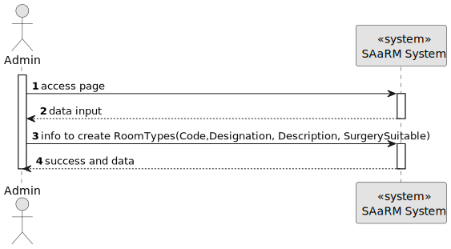
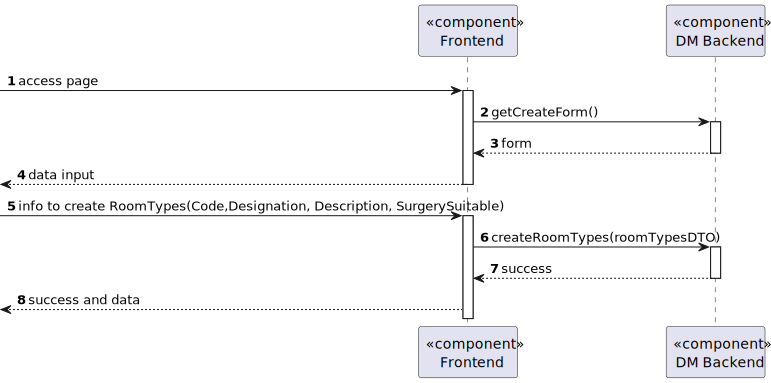
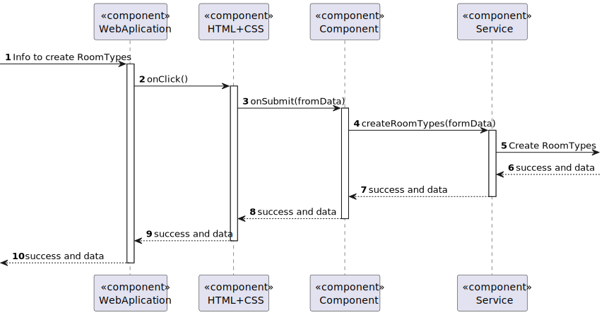

# US 7.2.10

## 1. Context

As an Admin, I want to add new Types of rooms, so that I can reflect on the available medical procedures in the system

## 2. Requirements

**US 7.2.10** As an Admin, I want to add new Types of rooms, so that I can reflect on the available medical procedures in the system

**Dependencies/References:**

* There is a dependency to "US 5.1.1- As an Admin, I want to register new backoffice users (e.g., doctors, nurses, technicians, admins) via an out-of-band process, so that they can access the
backoffice system with appropriate permissions."

* There is a dependency to "US 5.1.6- As a (non-authenticated) Backoffice User, I want to log in to the system using my credentials, so that I can access the backoffice features according to my assigned role."

**Input and Output Data**

**Input Data:**

* Typed data:
    * Code
    * Designation
    * Description
    * SurgerySuitable

**Output Data:**
* Display the success of the operation

## 3. Analysis

> **Question 1: What will be the Room Type fields to input when adding??**

> **Answer 1: a room type is characterized by an internal code, a designation and an optional longer description. it also indicates if it the room type is suitable for surgeries or not**

> **Question 2: With the characterization of the room type, the internal code must have a format? If so, what will be the format? For the designation, exists any restrition (max n° of characters, is unique, etc.)? If so, what restrition??**

> **Answer 2: code is a text entered by the Admin. it must be 8 characters long, no spaces, only letters, numbers, and dashes ("-") are allowed. it must be unique. designation. free text, alphanumeric, 100 characters max.**

## 4. Design

**Domain Class/es:** RoomTypes, RoomTypeId

**Controller:** RoomTypesController

**UI:** Admin.component.html

**Repository:** RoomTypesRepository

**Service:** RoomTypesService, AuthorizationService

### 4.1. Sequence Diagram

#### Create RoomTypes

**Sequence Diagram Level 1**

**Sequence Diagram Level 2**

**Sequence Diagram Level 3**

