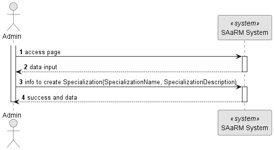
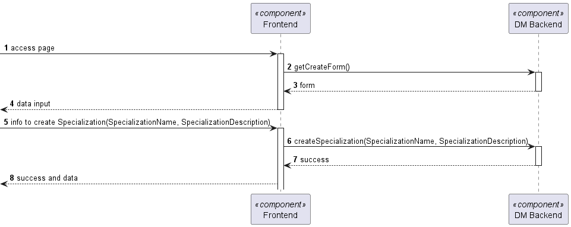
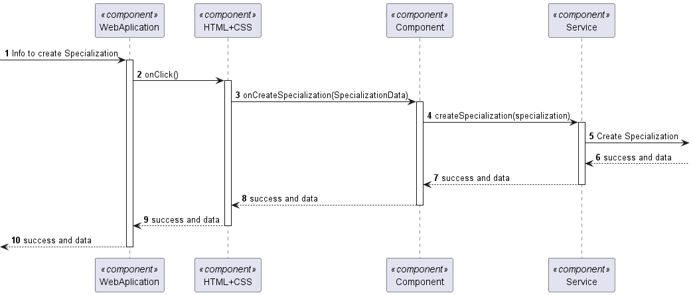

# US 7.2.11

## 1. Context

**US 7.2.11** As an Admin, I want to add new Specializations, so that I can update or correct
information about the staff and operation type (procedure).

## 2. Requirements

**US 7.2.11**

**Acceptance Criteria:**

- None

**Customer Specifications and Clarifications:**

> > **Question:
> The Specialization consist in what? Just a name or are there more fields?
>
> **Answer:
> a specialization has a code (for example, based on SNOMED CT (Systematized Nomenclature of Medicine - Clinical Terms)),
> a designation and an optional longer description**

**Input and Output Data**

**Input Data:**

* Typed data:
    * Specialization Designation
    * Specialization Description

* Selected data:
    * None
  
**Output Data:**

* Display the success of the operation and the data of the created specialization

## 3. Design

**Files:** specialization.service.ts - auth.service.ts - modal.service.ts - admin.component.ts -
admin.component.html - admin.component.scss - doctor.component.ts -
doctor.component.html - doctor.component.scss

### 3.1. Sequence Diagram

**Create Specialization Level 1**

**Create Specialization Level 2**

**Create Specialization Level 3**

