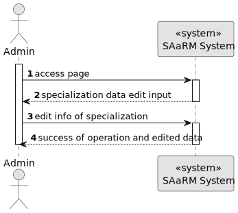
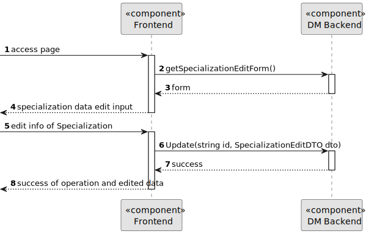
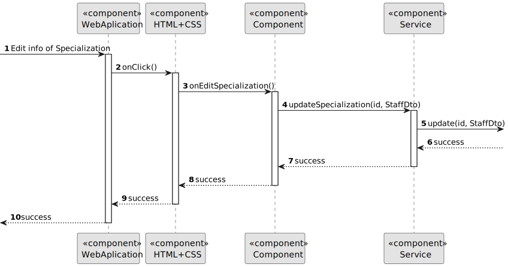
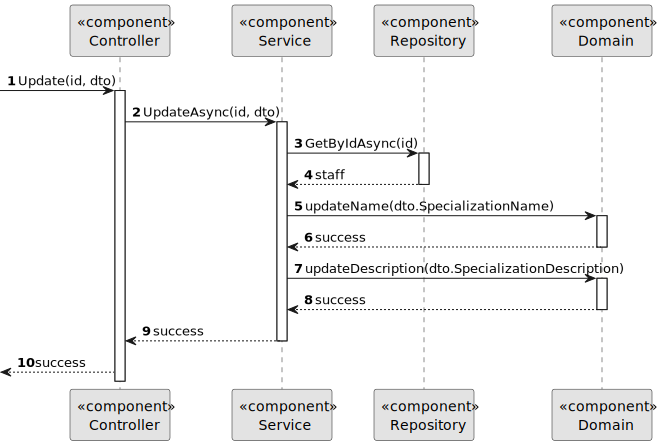

# US 7.2.13

## 1. Context

As part of the development of the software system, it is necessary to implement management functionalities within the administrative interface. These functionalities allow the user to update Specializations defined in the system.

## 2. Requirements

**US 7.2.13** As an Admin, I want to edit Specializations, so that I can update or correct information about the staff and operation type (procedure).

**Acceptance Criteria:** 

- It should be possible to edit the designation and description

**Customer Specifications and Clarifications:**

> **Question:** Relativamente à US 7.2.13 - "As an Admin, I want to edit Specializations, so that I can update or correct information about the staff and operation type (procedure).", quais são os parâmetros possíveis para edição? Por exemplo, designação, descrição, ...
>
>**Answer:** deve ser possivel editar a designação e a descrição

**Input and Output Data**

**Input Data:**
* Selected data:
  * Specialization
* Typed data:
    * Designation
    * Description

**Output Data:**
* Display the success of the operation

## 3. Design

**Domain Class/es:** Specialization

**Controller:** SpecializationController

**UI:** Admin.component

**Repository:**	SpecializationRepository

**Service:** SpecializationService, AuthorizationService

### 3.1. Sequence Diagram

**Edit Specialization Level 1**

**Edit Specialization Level 2**

**Edit Specialization Level 3 Frontend**

**Edit Specialization Level 3 Backend**

