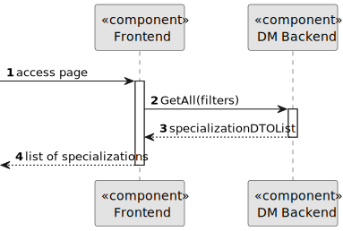

# US 7.2.15

## 1. Context

As part of the development of the software system, it is necessary to implement management functionalities within the administrative interface. These functionalities allow the admin to list specializations in order to modify them.

## 2. Requirements

**US 7.2.15** As an Admin, I want to list/search Specializations, so that I can see the details, and edit and remove Specializations

**Acceptance Criteria:** 

- Display the list of Specializations

**Output Data:**
* Display the list of Specializations

## 3. Design

**Domain Class/es:** Specialization

**Controller:** SpecializationController

**UI:** Admin.component

**Repository:**	SpecializationRepository

**Service:** SpecializationService, AuthorizationService

### 3.1. Sequence Diagram

**Login User Level 1**

**Login User Level 2**

**Login User Level 3**

