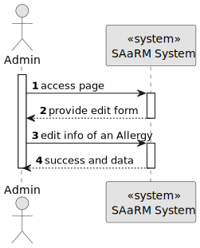
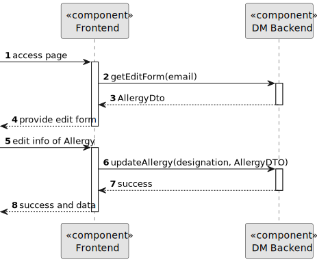
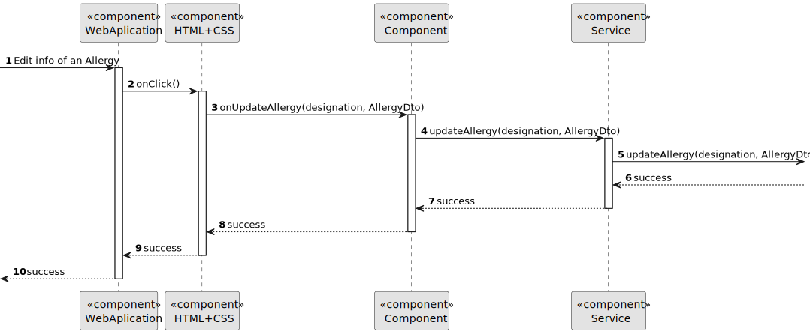

# US 7.2.16

## 1. Context

As Admin I want to update an allergy

## 2. Requirements

**US 7.2.16**

**Dependencies/References:**

* There is a dependency to "US 5.1.1 - As an Admin, I want to register new backoffice users (e.g., doctors, nurses, technicians, admins) via an out-of-band process, so that they can access the backoffice system with appropriate permissions."

* There is a dependency to "US 5.1.6 - As a (non-authenticated) Backoffice User, I want to log in to the system using my credentials, so that I can access the backoffice features according to my assigned role."
* 
* There is a dependency to "US 7.2.2 - As an Admin, I want to add new Allergy, so that the Doctors can use it to update the Patient Medical Record"

**Input and Output Data**

**Input Data:**

* Typed data:
  * Designation
  * Description

**Output Data:**
* Display the success of the operation and the data of the updated allergy (Update Allergy)

## 3. Analysis

> **Question 1: regarding User Story 7.2.16, we would like to confirm the details for updating an allergy. Could you clarify which parameters the admin should be able to modify when performing this action?**

> **Answer 1: it is possible to update the designation (to fix a typo for instance) and the description.**

## 4. Design

**Domain Class/es:** Allergy

**Controller:** AllergyController

**UI:** Admin.component.html

**Repository:**	AllergyRepository

**Service:** AllergyService, AuthorizationService

### 4.1. Sequence Diagram

#### Edit Allergy

**Sequence Diagram Level 1**

**Sequence Diagram Level 2**

**Sequence Diagram Level 3**

