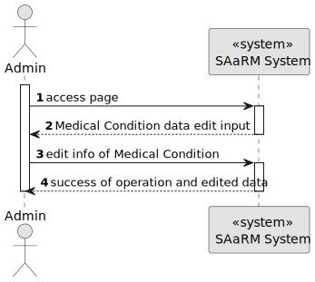
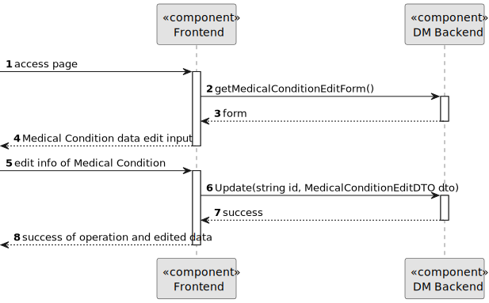
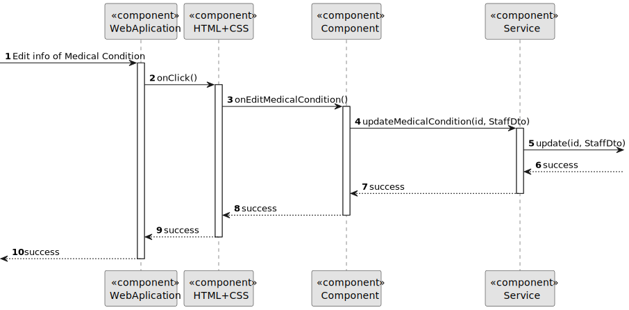
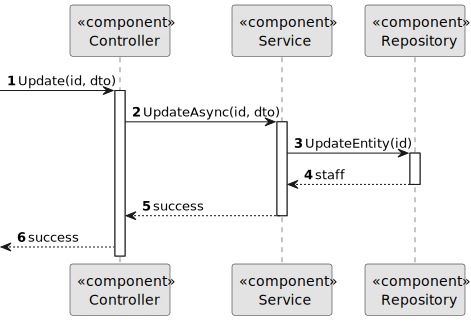

# US 7.2.17

## 1. Context

As part of the development of the software system, it is necessary to implement functionalities within the administrative interface. These functionalities are essential to allow the administrator to update existing Medical Conditions.

## 2. Requirements

**US 7.2.17** As Admin I want to update a medical condition

**Acceptance Criteria:** 

- It must have a designation, and a longer description, as well as a list of common symptoms

**Customer Specifications and Clarifications:**

> **Question:** Regarding User Story 7.2.17, we would like to clarify the requirements for updating a medical condition. Could you please confirm which parameters the admin should be allowed to modify in this process?
> 
>**Answer:** it is possible to update the designation (to fix a typo for instance) and the description.

**Input and Output Data**

**Input Data:**

* Selected data:
  * Medical Condition
* Typed data:
    * Designation
    * Description
    * Symptoms

**Output Data:**
* Display the success of the operation

## 3. Design

**Domain Class/es:** MedicalCondition

**Controller:** MedicalConditionController

**UI:** Admin.component

**Repository:**	MedicalConditionRepo

**Service:** MedicalConditionService, AuthorizationService

### 3.1. Sequence Diagram

**Edit Medical Condition Level 1**

**Edit Medical Condition Level 2**

**Edit Medical Condition Level 3 Frontend**

**Edit Medical Condition Level 3 Backend**

