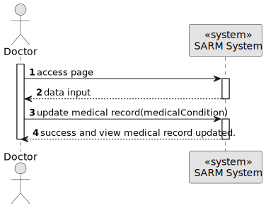

# US 7.2.6


## 1. Context

As part of the development of the software system, it is necessary to implement user management functionalities within the administrative interface. These functionalities are essential to allow on-authenticated users to log in to the system.

## 2. Requirements

**US 7.2.18** As a Doctor, I want to update an medical condition entry in a medical record

[//]: # (**Acceptance Criteria:** )

[//]: # ()
[//]: # (- )

[//]: # ()
[//]: # (**Customer Specifications and Clarifications:**)

[//]: # ()
[//]: # (> **Question:** )

[//]: # (>)

[//]: # (>**Answer:** )

**Dependencies/References:**

* There is a dependency to "US 7.2.5 As a Doctor, I want to search for Medical Conditions, so that I can use it to update
  the Patient Medical Record."


* There is a dependency to "US 7.2.4- As an Admin, I want to add new Medical Condition, so that the Doctors can use it
  to update the Patient Medical Record."


* There is a dependency to "US 7.2.2- As an Admin, I want to add new Allergy, so that the Doctors can use it to update
  the Patient Medical Record."

**Input and Output Data**

**Input Data:**

* Typed data:
    * medical condition (description)


**Output Data:**
* Display the success of the operation

[//]: # ()
[//]: # (## 3. Analysis)

[//]: # ()
[//]: # (> **Question:** )

[//]: # (>)

[//]: # (>**Answer:** )


[//]: # (### 3.1. Domain Model)

[//]: # (![sub domain model]&#40;us1000-sub-domain-model.svg&#41;)

## 4. Design


**Domain Class/es:** Medical Conditon, Medical Record

**Controller:** MedicalRecordController

**UI:** DoctorComponent

**Repository:**	MedicalRecordRepositiory

**Service:** MedicalRecordService, AuthorizationService


### 4.1. Sequence Diagram

**Update Medical Condition Level 1**



**Update Medical Condition Level 2**


**Update Medical Condition Level 3 FrontEnd**


**Update Medical Condition Level 3 BackEnd**


[//]: # (### 4.2. Class Diagram)

[//]: # ()
[//]: # (![a class diagram]&#40;us1000-class-diagram.svg "A Class Diagram"&#41;)
[//]: # ()
[//]: # (### 4.3. Applied Patterns)

[//]: # ()
[//]: # (### 4.4. Tests)

[//]: # ()
[//]: # (Include here the main tests used to validate the functionality. Focus on how they relate to the acceptance criteria.)

[//]: # ()
[//]: # ()
[//]: # ()
[//]: # (**Before Tests** **Setup of Dummy Users**)

[//]: # ()
[//]: # (```)

[//]: # (    public static SystemUser dummyUser&#40;final String email, final Role... roles&#41; {)

[//]: # (        final SystemUserBuilder userBuilder = new SystemUserBuilder&#40;new NilPasswordPolicy&#40;&#41;, new PlainTextEncoder&#40;&#41;&#41;;)

[//]: # (        return userBuilder.with&#40;email, "duMMy1", "dummy", "dummy", email&#41;.build&#40;&#41;;)

[//]: # (    })

[//]: # ()
[//]: # (    public static SystemUser crocodileUser&#40;final String email, final Role... roles&#41; {)

[//]: # (        final SystemUserBuilder userBuilder = new SystemUserBuilder&#40;new NilPasswordPolicy&#40;&#41;, new PlainTextEncoder&#40;&#41;&#41;;)

[//]: # (        return userBuilder.with&#40;email, "CroC1_", "Crocodile", "SandTomb", email&#41;.withRoles&#40;roles&#41;.build&#40;&#41;;)

[//]: # (    })

[//]: # ()
[//]: # (    private SystemUser getNewUserFirst&#40;&#41; {)

[//]: # (        return dummyUser&#40;"dummy@gmail.com", Roles.ADMIN&#41;;)

[//]: # (    })

[//]: # ()
[//]: # (    private SystemUser getNewUserSecond&#40;&#41; {)

[//]: # (        return crocodileUser&#40;"crocodile@gmail.com", Roles.OPERATOR&#41;;)

[//]: # (    })

[//]: # ()
[//]: # (```)

[//]: # ()
[//]: # (**Test 1:** *Verifies if Users are equals*)

[//]: # ()
[//]: # ()
[//]: # (```)

[//]: # (@Test)

[//]: # (public void verifyIfUsersAreEquals&#40;&#41; {)

[//]: # (    assertTrue&#40;getNewUserFirst&#40;&#41;.equals&#40;getNewUserFirst&#40;&#41;&#41;&#41;;)

[//]: # (})

[//]: # (````)

[//]: # ()
[//]: # (## 5. Implementation)

[//]: # ()
[//]: # ()
[//]: # (### Methods in the UsersController)

[//]: # (* **public async Task<ActionResult<UserDto>> Create&#40;CreatingUserDto dto&#41;**  this method creates a user)

[//]: # ()
[//]: # ()
[//]: # ()
[//]: # (## 6. Integration/Demonstration)

[//]: # ()


[//]: # (## 7. Observations)

[//]: # ()
[//]: # (*This section should be used to include any content that does not fit any of the previous sections.*)

[//]: # ()
[//]: # (*The team should present here, for instance, a critical perspective on the developed work including the analysis of alternative solutions or related works*)

[//]: # ()
[//]: # (*The team should include in this section statements/references regarding third party works that were used in the development this work.*)