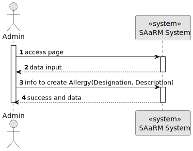
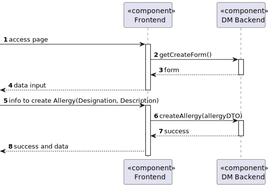
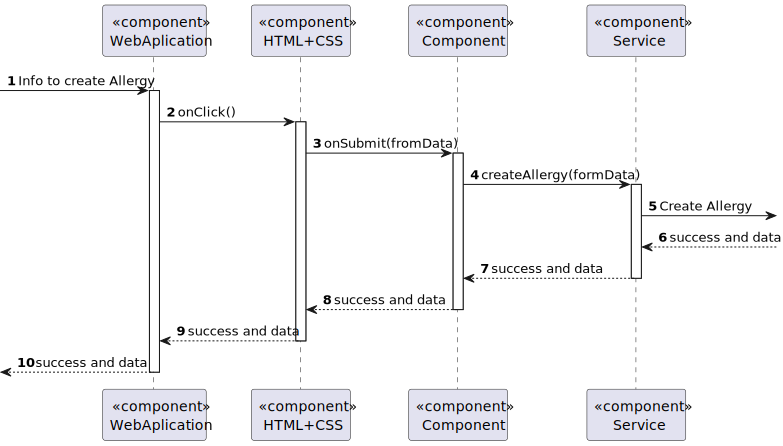

# US 7.2.2

## 1. Context

As an Admin, I want to add new Allergy, so that the Doctors can use it to update the Patient Medical Record

## 2. Requirements

**US 7.2.2** As an Admin, I want to add new Allergy, so that the Doctors can use it to update the Patient Medical Record

**Dependencies/References:**

* There is a dependency to "US 5.1.1- As an Admin, I want to register new backoffice users (e.g., doctors, nurses, technicians, admins) via an out-of-band process, so that they can access the
backoffice system with appropriate permissions."

* There is a dependency to "US 5.1.6- As a (non-authenticated) Backoffice User, I want to log in to the system using my credentials, so that I can access the backoffice features according to my assigned role."

**Input and Output Data**

**Input Data:**

* Typed data:
    * Designation
    * Description

**Output Data:**
* Display the success of the operation

## 3. Analysis

> **Question 1: What information is to be known in an Allergy? Like designation, and anything more??**

> **Answer 1: it consist of a code (for instance, SNOMED CT (Systematized Nomenclature of Medicine - Clinical Terms) or ICD-11 (International Classification of Diseases, 11th Revision)), a designation and an optional longer description**

## 4. Design

**Domain Class/es:** Allergy

**Controller:** AllergyController

**UI:** Admin.component.html

**Repository:**	AllergyRepository

**Service:** AllergyService, AuthorizationService

### 4.1. Sequence Diagram

#### Create Allergies

**Sequence Diagram Level 1**

**Sequence Diagram Level 2**

**Sequence Diagram Level 3**

