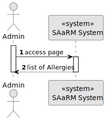
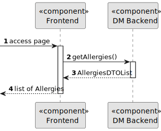
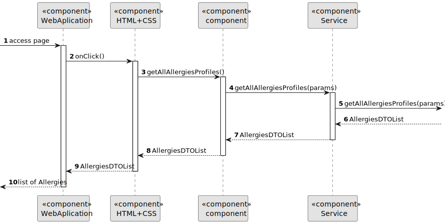

# US 7.2.3

## 1. Context

As a Doctor, I want to search for Allergies, so that I can use it to update the Patient Medical Record

## 2. Requirements

**US 7.2.3** As a Doctor, I want to search for Allergies, so that I can use it to update the Patient Medical Record

**Dependencies/References:**

* There is a dependency to "US 7.2.2 As an Admin, I want to add new Allergy, so that the Doctors can use it to update the Patient Medical Record"

**Input and Output Data**

**Input Data:**

* Typed data:
    * Designation

**Output Data:**
* Display the success of the operation

## 3. Analysis

> **Question 1: Do you want an allergy to be deleted, inactivated or neither?**

> **Answer 1: since the requirement 7.2.3 is about searching an allergy while updating the medical record, I'll assume, your question is about the "medical record entry - allergy" and not about "allergy". An entry in the medical record cannot be deleted. it can however be marked as "not meaningful anymore". For instance some allergies occur during childhood but disappear as the immune system matures**

> **Question 2: Regarding User Story 7.2.3, we would like to confirm how the allergy search functionality should operate. Should the search return all registered allergies, or should it allow searching based on a specific parameter? If it’s based on a parameter, could you specify which one?**

> **Answer 2: This requirement is related to the adding/updating of an allergy entry in the medical record. Thus, when the doctor is adding or editing an allergy entry, they must be able to search for allergies by code or designation instead of entering the "id" directly or selecting it from a drop down.**

> **Question 3: Atualmente, é possível adicionar novos "tipos de sala" e, quando um doutor faz um pedido de "appointment", tem de escolher uma sala já existente no sistema. No entanto, não existe nenhum requisito que exija a criação, edição, visualização ou eliminação das salas de operação disponíveis no sistema. Estas funcionalidades podem ser realizadas sem interface de utilizador (por exemplo, através do Postman)?**

> **Answer 3: grupos até 3 elementos inscriotos a ARQSI podem criar salas via bootstraping ou via API. não necessitam criar UI. os grupos de 4 ou 5 elementos inscritos a ARQSI devem criar UI**

## 4. Design

**Domain Class/es:** Allergy

**Controller:** AllergyController

**UI:** Doctor.component.html

**Repository:**	AllergyRepository

**Service:** AllergyService, AuthorizationService

### 4.1. Sequence Diagram

#### Select Allergies

**Sequence Diagram Level 1**

**Sequence Diagram Level 2**

**Sequence Diagram Level 3**

