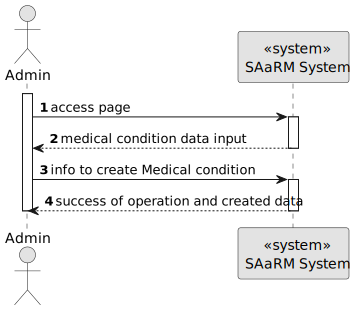
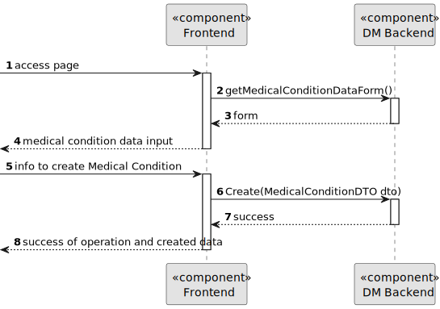
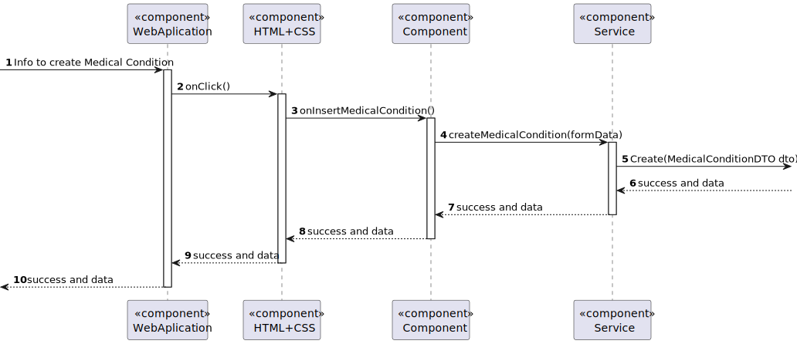

# US 7.2.4

## 1. Context

As part of the development of the software system, it is necessary to implement functionalities within the administrative interface. These functionalities are essential to allow the administrator to add new Medical Conditions.

## 2. Requirements

**US 7.2.4** As an Admin, I want to add new Medical Condition, so that the Doctors can use it to update the Patient Medical Record.

**Acceptance Criteria:** 

- The Code should follow, for example,  ICD (International Classification of Diseases) formatting
- It must have a designation, and a longer description, as well as a list of common symptoms

**Customer Specifications and Clarifications:**

> **Question:** The medical condition consist in what? Just a name or are there more fields?
>
>**Answer:** it consists of a code (for example following ICD (International Classification of Diseases)), a designation and a longer description as well a list of common symptoms

> **Question:** Earlier, you said the medical condition needed a code. Is this code automatic or is writen by the admin?
>
>**Answer:** it must conform with the classficiation system you select, for instance, SNOMED CT (Systematized Nomenclature of Medicine - Clinical Terms) or ICD-11 (International Classification of Diseases, 11th Revision)

> **Question:** Qual seria o tamanho máximo de uma designação e descrição de uma alergia?
>
>**Answer:** designação, max 100 caracteres, descrição, máximo 2048 caracteres

> **Question:** What are the symptoms for a medical record? Are they a list already present in the system, and when creating the medical record, do you select the symptoms? If yes, what happens when a disease has a symptom that is not in that list? Who creates it in the system?
>
>**Answer:** symptoms are free text

**Input and Output Data**

**Input Data:**

* Typed data:
    * Code
    * Designation
    * Description
    * Symptoms

**Output Data:**
* Display the success of the operation

## 3. Design

**Domain Class/es:** MedicalCondition

**Controller:** MedicalConditionController

**UI:** Admin.component

**Repository:**	MedicalConditionRepo

**Service:** MedicalConditionService, AuthorizationService

### 3.1. Sequence Diagram

**Create Medical Condition Level 1**

**Create Medical Condition Level 2**

**Create Medical Condition Level 3 Frontend**

**Create Medical Condition Level 3 Backend**

