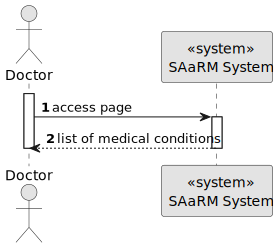
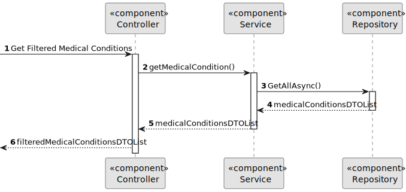

# US 7.2.5

## 1. Context

As part of the development of the software system, it is necessary to implement a feature that enables a Doctor to search for Medical Conditions while updating a Patient's medical record

## 2. Requirements

**US 7.2.5** As a Doctor, I want to search for Medical Conditions, so that I can use it to update the Patient Medical Record.

**Acceptance Criteria:** 

- The Doctor should be able to search for a medical condition by code or designation

**Customer Specifications and Clarifications:**

> **Question:** What do you define as Medical Condition? Is it an allergy?
>
>**Answer:** they are two different things. a Medical Condition represents a diagnosed health issue or disease. Examples: Diabetes, Hypertension, Asthma, etc.

> **Question:** Gostaria de lhe perguntar se existe alguma lista de medical conditions que prefere que utilizemos no sistema por default, se sim, quais?
>
>**Answer:** default medical conditions (ICD-11):
> A04.0 Cholera
> A08.0: Rotavirus enteritis
> B20: Human Immunodeficiency Virus (HIV) disease
> B50: Plasmodium falciparum malaria
> 2A20.0: Malignant neoplasm of lung
> 2F44.0: Malignant neoplasm of the breast
> 3A01.1: Iron deficiency anemia
> 4A44: Hereditary hemochromatosis
> 5A11: Type 1 diabetes mellitus
> 5B55: Obesity
> 6A80: Major depressive disorder
> 6C40: Generalized anxiety disorder
> FB20.1: Osteoporosis with pathological fracture
> FB81.1: Osteoarthritis of the knee
> FB81.2: Osteoarthritis of the hip
> FB80.1: Rheumatoid arthritis
> FA24.0: Fracture of femur
> FA22.0: Fracture of radius and ulna
> FA21.0: Dislocation of shoulder
> FB70.0: Low back pain

> **Question:** Também gostariamos de perguntar se quando diz "I want to search for Medical Conditions, so that I can use it to update the Patient Medical Record" o que é que implica a ultima parte?
>
>**Answer:** quando o médico está a editar o registo médico do paciente, deve ter a possibilidade de inserir entradas de alergias e/ou condições médicas através de pesquisa de alergias/condições médicas

> **Question:** Regarding User Story 7.2.5, we would like to confirm how the search for medical conditions should work. Should the search return all registered medical conditions, or should it allow filtering based on a specific parameter? If it’s based on a parameter, could you specify which one?
>
>**Answer:** This requirement is related to the adding/updating of an medical condition entry in the medical record. Thus, when the doctor is adding or editing a medical condition entry, they must be able to search for medical condition by code or designation instead of entering the "id" directly or selecting it from a drop down.

**Dependencies/References:**

* There is a dependency to US 7.2.6, as this user story is used in tandem with its functionalities
* There is a dependency to 7.2.4, as there needs to be Medical Conditions in order to search for them

**Input and Output Data**

**Input Data:**
* Typed data:
    * Code/Designation

* **Output Data:**
  * Matching Medical Conditions

## 3. Design

**Domain Class/es:** MedicalCondition

**Controller:** MedicalConditionController

**UI:** Doctor.component

**Repository:**	MedicalConditionRepo

**Service:** MedicalConditionService, AuthorizationService

### 3.1. Sequence Diagram

**Login User Level 1**

**Login User Level 2**

**Login User Level 3 Frontend**

**Login User Level 3 Backend**

