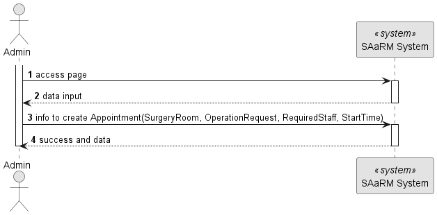

# US 7.2.8

## 1. Context

**US 7.2.8** As a Doctor, I want to create a Surgery Appointment, so that the Patient doesn’t need to wait for the
automatically generated planning.

## 2. Requirements

**US 7.2.8**

**Acceptance Criteria:**

- None

**Customer Specifications and Clarifications:**

> **Question:Should the doctor be able to make a surgery appointment without making a prior operation request for said
> appointment?
> As a follow-up question, what exactly can the doctor update about the appointment? Can they, for example, change the
> surgery room for the surgery?
**
>
> **Answer:The doctor must be able to "transform" an existing operation request into an actual appointment by specifying
> the room, date and team of the surgery. the system must ensure all the resources and personnel is available at the
> selected time according to the operation type duration.after the appointment is planned, it is possible to update the
> team, room and date. the system must ensure all the resources and personnel is available at the selected time
> according
> to the operation type duration.
**
> **Question:
> According to a previous answer about this requirement, when the doctor attempts the creation of an appointment, they
> specify room, date and team. But do they also specify the time in which the surgery should start?
>
> **Answer: yes**
>
> **Question:
> Regarding the team selected by the doctor when creating the appointment, does this team include only doctors, doctors
> and anesthetists, or doctors, anesthetists and cleaners?
>
> **Answer: it must include the whole team that conforms to the team composition according to the operation type
specification**
>
> **Question:
> When the doctor selects the team for the Appointment, that includes doctors and nurses. Regarding cleaners, which
> staff (doctors, nurses, interns) can be selected for that role? And is there any criteria for that selection?
>
> **Answer: the doctor only selects the medical team**
>
> > **Question:
> When a doctor is selecting the staff for an appointment, what should happen if, for every slot he could choose, there
> aren't enough staffs to perform the operation?
>
> **Answer: the appointment cannot be scheduled for that date. the doctor must choose a different date**

**Input and Output Data**

**Input Data:**

* Typed data:
    * Start Date

* Selected data:
    * Operation Request
    * Surgery Room
    * Required Staff

**Output Data:**

* Display the success of the operation and the data of the created appointment

## 3. Design

**Files:** appointment.service.ts - auth.service.ts - modal.service.ts - admin.component.ts -
admin.component.html - admin.component.scss - doctor.component.ts -
doctor.component.html - doctor.component.scss

### 3.1. Sequence Diagram

**Create Appointment Level 1**

**Create Appointment Level 2**

**Create Appointment Level 3**

