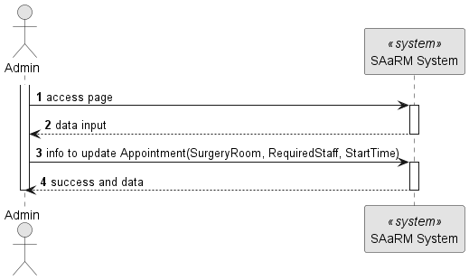
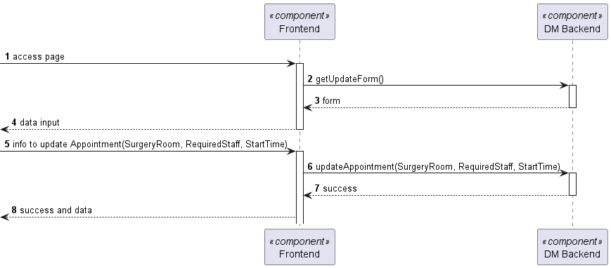
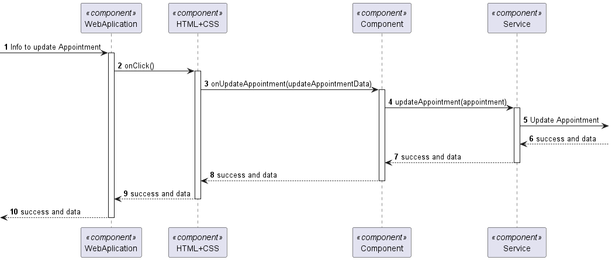

# US 7.2.9

## 1. Context

**US 7.2.9** As a Doctor, I want to update a Surgery Appointment, so that I can override the
automatically generated planning.

## 2. Requirements

**US 7.2.9**

**Acceptance Criteria:**

- None

**Customer Specifications and Clarifications:**

> > **Question:
> As a follow-up question, what exactly can the doctor update about the appointment? Can they, for example, change the
> > surgery room for the surgery?
>
> **Answer:
after the appointment is planned, it is possible to update the team, room and date. the system must ensure all the
resources and personnel is available at the selected time according to the operation type duration.**

**Input and Output Data**

**Input Data:**

* Typed data:
    * Start Date

* Selected data:
    * Surgery Room
    * Required Staff

**Output Data:**

* Display the success of the operation and the data of the updated appointment

## 3. Design

**Files:** appointment.service.ts - auth.service.ts - modal.service.ts - admin.component.ts -
admin.component.html - admin.component.scss - doctor.component.ts -
doctor.component.html - doctor.component.scss

### 3.1. Sequence Diagram

**Update Appointment Level 1**

**Update Appointment Level 2**

**Update Appointment Level 3**

