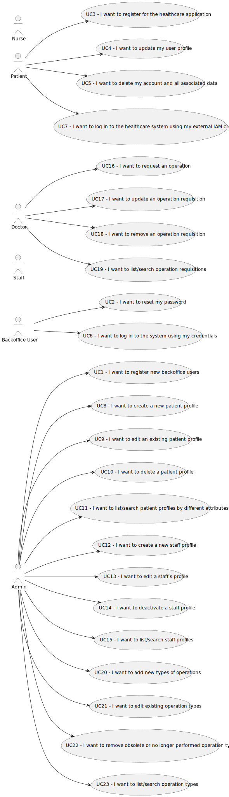

# Use Case Diagram (UCD)

**In the scope of this project, there is a direct relationship of _1 to 1_ between Use Cases (UC) and User Stories (US).**

[//]: # (However, be aware, this is a pedagogical simplification. On further projects and curricular units might also exist _1 to)

[//]: # (N **and/or** N to 1 relationship between US and UC.)

[//]: # (**For each UC/US, it must be provided evidences of applying main activities of the software development process &#40;)

[//]: # (requirements, analysis, design, tests and code&#41;. Gather those evidences on a separate file for each UC/US and set up a)

[//]: # (link as suggested below.**)

# Use Cases / User Stories

| UC/US     | Description                                                                                                                                                         |                   
|:----------|:--------------------------------------------------------------------------------------------------------------------------------------------------------------------|
| US 5.1.1  | [Register new backoffice users ](../../BackofficeModule\5.1.1\readme.md)                                                                                            |
| US 5.1.2  | [Publish Sale Announcement](../../BackofficeModule\5.1.2\readme.md)                                                                                                 |
| US 5.1.3  | [Reset password](../../BackofficeModule\5.1.3\readme.md)                                                                                                            |
| US 5.1.4  | [Register for the healthcare application](../../BackofficeModule\5.1.4\readme.md)                                                                                   |
| US 5.1.5  | [Update profile](../../BackofficeModule\5.1.5\readme.md)                                                                                                            |
| US 5.1.6  | [Delect account](../../BackofficeModule\5.1.6\readme.md)                                                                                                            |
| US 5.1.7  | [Log in to the system](../../BackofficeModule\5.1.7\readme.md)                                                                                                      |
| US 5.1.8  | [Create a new pacient profile](../../BackofficeModule\5.1.8\readme.md)                                                                                              |             
| US 5.1.9  | [Edit an existing patient profile](../../BackofficeModule\5.1.9\readme.md)                                                                                          |
| US 5.1.10 | [Delete a patient profile](../../BackofficeModule\5.1.10\readme.md)                                                                                                 |
| US 5.1.11 | [List/search patient profiles](../../BackofficeModule\5.1.11\readme.md)                                                                                             |
| US 5.1.12 | [Create a new staff profile](../../BackofficeModule\5.1.12\readme.md)                                                                                               |
| US 5.1.13 | [Edit a staff’s profile](../../BackofficeModule\5.1.13\readme.md)                                                                                                   |
| US 5.1.14 | [Deactivate a staff profile](../../BackofficeModule\5.1.14\readme.md)                                                                                               |
| US 5.1.15 | [List/search staff profiles](../../BackofficeModule\5.1.15\readme.md)                                                                                               |
| US 5.1.15 | [List/search staff profiles](../../BackofficeModule\5.1.15\readme.md)                                                                                               |
| US 5.1.16 | [Request an operation](../../BackofficeModule\5.1.16\readme.md)                                                                                                     |
| US 5.1.17 | [Update an operation requisition](../../BackofficeModule\5.1.17\readme.md)                                                                                          |
| US 5.1.18 | [Remove an operation requisition](../../BackofficeModule\5.1.18\readme.md)                                                                                          |            
| US 5.1.19 | [List/search operation requisitions](../../BackofficeModule\5.1.19\readme.md)                                                                                       |
| US 5.1.20 | [Add new types of operations](../../BackofficeModule\5.1.20\readme.md)                                                                                              |
| US 5.1.21 | [Edit existing operation types](../../BackofficeModule\5.1.21\readme.md)                                                                                            |
| US 5.1.22 | [Remove operation types](../../BackofficeModule\5.1.23\readme.md)                                                                                                   |
| US 5.1.23 | [List/search operation types](../../BackofficeModule\5.1.23\readme.md)                                                                                              |
| US 6.1.1  | [Integrated UI for all modules of the system ](../../BackofficeModule\6.1.1\readme.md)                                                                              |
| US 6.1.2  | [Create application menu to adjust according to my role](../../BackofficeModule\6.1.2\readme.md)                                                                    |
| US 6.1.3  | [Show on the 3D visualization module](../../BackofficeModule\6.1.3\readme.md)                                                                                       |
| US 6.1.4  | [Info in the planning module](../../BackofficeModule\6.1.4\readme.md)                                                                                               |
| US 6.1.5  | [Info with the plan generated by the planning module](../../BackofficeModule\6.1.5\readme.md)                                                                       |   
| US 6.2.1  | [Register patient UI](../../BackofficeModule\6.2.1\readme.md)                                                                                                       |
| US 6.2.2  | [Update patient profile UI](../../BackofficeModule\6.2.2\readme.md)                                                                                                 |
| US 6.2.3  | [Delete patient account UI](../../BackofficeModule\6.2.3\readme.md)                                                                                                 |
| US 6.2.4  | [Log in to the system UI](../../BackofficeModule\6.2.4\readme.md)                                                                                                   |
| US 6.2.5  | [Patient log in to the system UI](../../BackofficeModule\6.2.5\readme.md)                                                                                           |
| US 6.2.6  | [Create patient profile UI](../../BackofficeModule\6.2.6\readme.md)                                                                                                 |
| US 6.2.7  | [Admin update patient profile UI](../../BackofficeModule\6.2.7\readme.md)                                                                                           |
| US 6.2.8  | [Admin delete patient account UI](../../BackofficeModule\6.2.8\readme.md)                                                                                           |             
| US 6.2.9  | [Admin list/search patient profiles UI](../../BackofficeModule\6.2.9\readme.md)                                                                                     |
| US 6.2.10 | [Admin create a staff profile UI](../../BackofficeModule\6.2.10\readme.md)                                                                                          |
| US 6.2.11 | [Admin edit a staff profile UI](../../BackofficeModule\6.2.11\readme.md)                                                                                            |
| US 6.2.12 | [Admin deactivate a staff profile UI](../../BackofficeModule\6.2.12\readme.md)                                                                                      |
| US 6.2.13 | [Admin list/search a staff profile UI](../../BackofficeModule\6.2.13\readme.md)                                                                                     |
| US 6.2.14 | [Doctor request operation UI](../../BackofficeModule\6.2.14\readme.md)                                                                                              |
| US 6.2.15 | [Doctor update operation UI](../../BackofficeModule\6.2.15\readme.md)                                                                                               |
| US 6.2.16 | [Doctor remove operation UI](../../BackofficeModule\6.2.16\readme.md)                                                                                               |
| US 6.2.17 | [Doctor list/search operation UI](../../BackofficeModule\6.2.17\readme.md)                                                                                          |
| US 6.2.18 | [Doctor add new types of operation UI](../../BackofficeModule\6.2.18\readme.md)                                                                                     |            
| US 6.2.19 | [Doctor edits types of operation UI](../../BackofficeModule\6.2.19\readme.md)                                                                                       |
| US 6.2.20 | [Doctor remove operation types UI](../../BackofficeModule\6.2.20\readme.md)                                                                                         |
| US 6.2.21 | [Doctor list/search operation types UI](../../BackofficeModule\6.2.21\readme.md)                                                                                    |
| US 6.3.1  | [Admin scheduling of a set of operations](../../BackofficeModule\63.1\readme.md)                                                                                    |
| US 6.3.2  | [Admin solution dimension](../../BackofficeModule\6.3.2\readme.md)                                                                                                  |
| US 6.3.3  | [Admin obtain a good schedule](../../BackofficeModule\6.3.3\readme.md)                                                                                              |                          |
| US 6.4.1  | [Deployment of one of the RFP modules](../../BackofficeModule\6.4.1\readme.md)                                                                                      |
| US 6.4.2  | [Clients on the DEI's internal network](../../BackofficeModule\6.4.2\readme.md)                                                                                     |
| US 6.4.3  | [Clients listed in the requirement 6.3.2](../../BackofficeModule\6.4.3\readme.md)                                                                                   |
| US 6.4.4  | [Identify and quantify the risks involved in the recommended solution.](../../BackofficeModule\6.4.4\readme.md)                                                     |
| US 6.4.5  | [Define the MBCO  to propose to stakeholders](../../BackofficeModule\6.4.5\readme.md)                                                                               |  
| US 6.4.6  | [Backup strategy to be proposed, justified and implemented that minimizes RPO](../../BackofficeModule\6.4.6\readme.md)                                              |
| US 6.4.7  | [Define a public folder for all users registered on the system](../../BackofficeModule\6.4.7\readme.md)                                                             |
| US 6.4.8  | [List users with more than 3 incorrect accesses attempts](../../BackofficeModule\6.4.8\readme.md)                                                                   |  
| US 6.5.1  | [3D representation of the hospital/clinic floor](../../BackofficeModule\6.5.1\readme.md)                                                                            |
| US 6.5.2  | [Appropriate textures, mapped onto the floor, walls, ent](../../BackofficeModule\6.5.2\readme.md)                                                                   |
| US 6.5.3  | [Hospital/clinic floor illuminated](../../BackofficeModule\6.5.3\readme.md)                                                                                         |
| US 6.5.4  | [Control the camera with the mouse](../../BackofficeModule\6.5.4\readme.md)                                                                                         |
| US 6.6.1  | [Techinical solution and affects on clients personal data](../../BackofficeModule\6.6.1\readme.md)                                                                  |
| US 6.6.2  | [Nodify the responsible authority in case of a data breach, so that I comply with GDPR’s breach notification requirements.](../../BackofficeModule\6.6.2\readme.md) |

