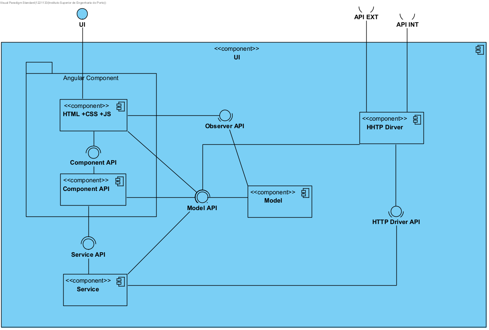
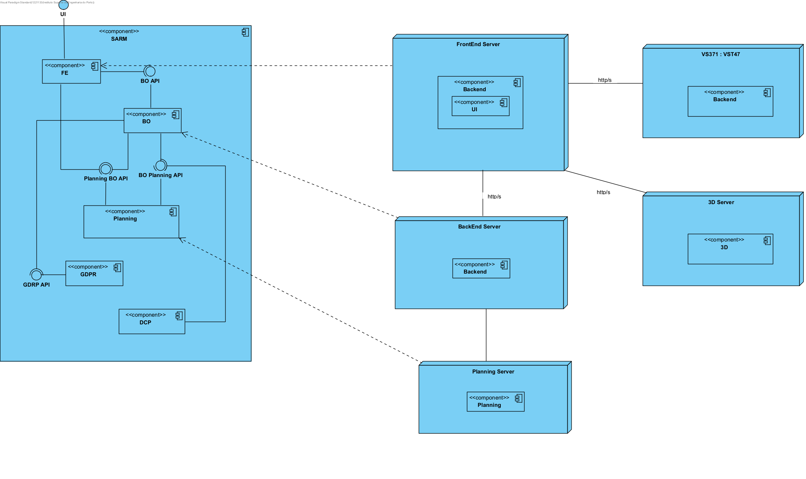

# Diagrams Sprint 2

## Level 1

### Logial and Implementation View

## Level 2

### Logial and Implementation View

## Level 3

### UI Logical View

## Physical View

### Logial and Physical View

